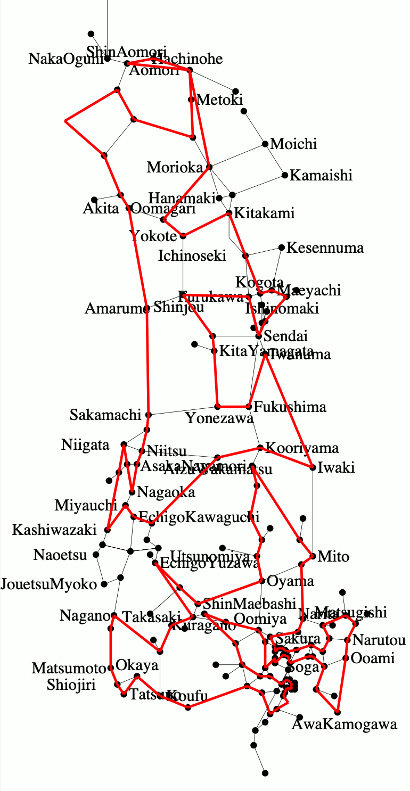
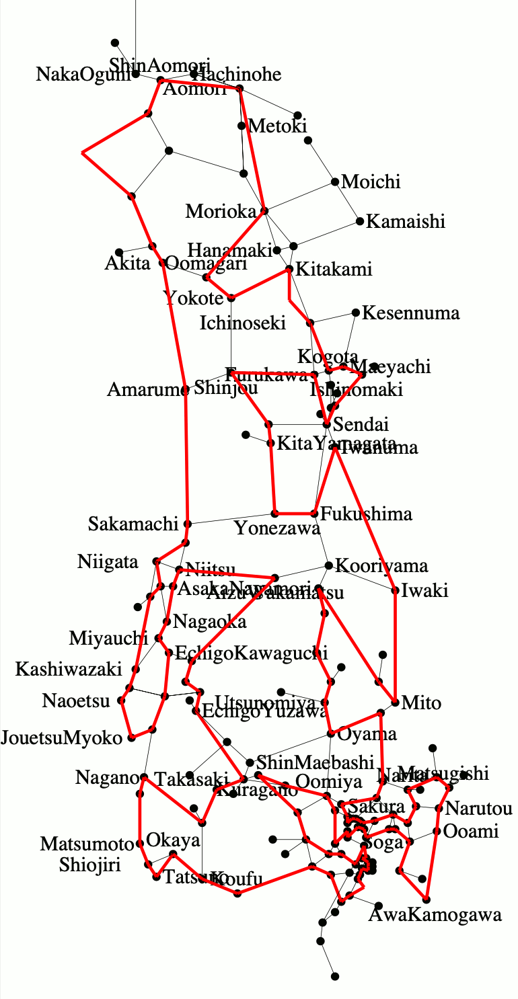
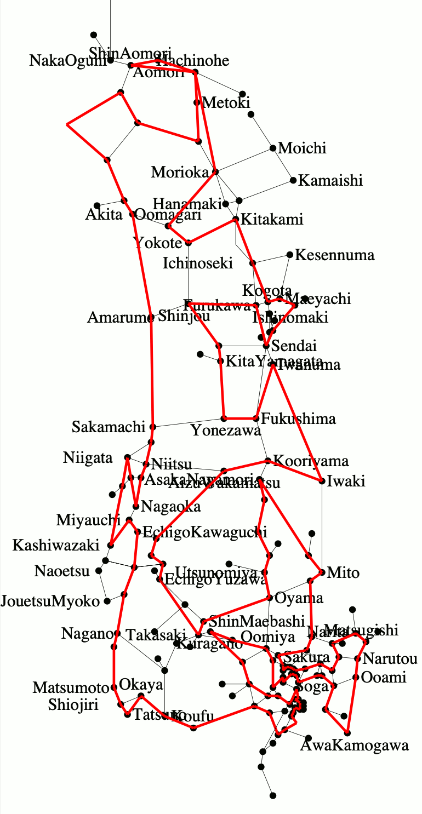

# JR東日本株主優待最長営業キロO型きっぷを求めたメモ （2021年4月版）

## 概要

* [JR東日本の株主優待割引](https://www.jreast.co.jp/investor/treat/01.html)を利用した最長O型きっぷを求めたい
* JR東日本の株主優待は、任意の自社線内で完結する片道乗車券のみならず、一部の連絡運輸についても適用可能であり、社線を経由することで最長キロを伸ばせる可能性がある
* O型きっぷに関しては、JR駅発着となるため、通過連絡運輸であれば社線を経由できることになる
* 通過連絡で経由する社線のキロ程は、JRのキロ程とは運賃計算上切り離されており、運賃計算キロをもって最長O型ルートを算出する意味がないので、営業キロ最長を算出したい
* ただし、通過連絡運輸には、規則の解釈上の制約が2つあるため、それらのすべてを考慮する必要がある
* さらにもちろん、JR東日本との間で通過連絡運輸が行われていたとしても、「JR東日本側に株主優待割引を適用可能なO型きっぷ」として発券できなければ意味がないため、その考察も必要となる
* いわゆる8の字乗車を認める場合、O型ルートでこれを許すためには工夫が必要である
* これらの計算をじっさいに行うと、首都圏部分への出入りについて孤立ループが固定化する現象が発生するが、その回避を、今回はLee型の計算に頼ることなく、制約式を工夫することで行うことができた

## 規則の考察

[JR最長](https://github.com/yonezawaizumi/lop-toolkit/tree/master/data/honshu-longest-result%E2%88%92202003/)の場合、規則の考察は「経路特定区間における制約式」以外では事前に行わず、計算結果を求めた後に考察を行いました。
しかし、本テーマにおいてはそもそも「通過連絡運輸が可能な線区」を考察しない限りあらゆる計算が不可能であるため、規則や実運用上の問題点を先に考察しておくこととします。

### 問題１: O型きっぷを発券可能な社線

現在、通過連絡運輸に限らず、あらゆる連絡運輸の詳細については、旅客連絡運輸取扱基準規程別表（連基別表）が非公開資料とされてしまっています。

そこで今回は、二次資料としてもっともよくメンテナンスされている、[「ＪＲ 連絡運輸 取扱会社線一覧表」](http://mars.travel.coocan.jp/transfer.html)を参照させていただいた上で、これらのうちJR東日本で利用可能な通過連絡を改めて調査することとしました。

#### JR東日本との通過連絡運輸を実施している線区

今回はJR東日本の株主優待割引を利用するため、東日本以外のJR各社の路線を経由することはできません。そのため、まず先述のページから、JR東日本線と直接接続しかつ（JR東日本を両端とし社線を通過する）通過連絡運輸を行う線区を、まず列挙します。

| No. | 社線 | 接続駅A | 設定範囲 | 接続駅B | 設定範囲 |
|:--:|:--:|:--:|:--:|:--:|:--:|
| 1. | 青い森鉄道 | 青森 | 全駅 | 野辺地 | 大湊線各駅 | 
| 2. | 青い森鉄道 | 八戸 | 全駅 | 野辺地 | 大湊線各駅 | 
| 3. | 青い森鉄道 | 青森 | 全駅 | 八戸 | 八戸線各駅 | 
| 4. | 青い森・いわて銀河 | 盛岡 | 全駅 | 野辺地 | 大湊線各駅 | 
| 5. | 青い森・いわて銀河 | 好摩 | 全駅 | 野辺地 | 大湊線各駅 | 
| 6. | 青い森・いわて銀河 | 盛岡 | 全駅 | 八戸 | 八戸線各駅 | 
| 7. | 青い森・いわて銀河 | 好摩 | 全駅 | 八戸 | 八戸線各駅 | 
| 8. | 青い森・いわて銀河 | 盛岡 | 全駅 | 青森 | 全駅 | 
| 9. | 青い森・いわて銀河 | 好摩 | 全駅 | 青森 | 全駅 | 
| 10. | IGRいわて銀河鉄道 | 盛岡 | 全駅 | 好摩 | 全駅 | 
| 11. | えちごトキめき鉄道 | 直江津 | 全駅 | 上越妙高 | 全駅 | 
| 12. | えちトキ・しなの | 直江津 | 黒井-新潟間 | 長野 | 松本-稲荷山間・<br>篠ノ井-安茂里間 | 
| 13. | 北越急行 | 六日町 | 全駅 | 十日町 | 全駅 | 
| 14. | 北越急行 | 六日町 | 全駅 | 犀潟 | 全駅 | 
| 15. | 北越急行 | 十日町 | 全駅 | 犀潟 | 全駅 | 
| 16. | 鹿島臨海鉄道 | 鹿島サッカースタジアム | 成田-佐原間・<br>鹿島線各駅 | 水戸 | 藤代-日立間・<br>常陸青柳-常陸大宮間・<br>南酒出-常陸太田間・<br>結城-友部間 | 
| 17. | 東京地下鉄 | 中野 | 高円寺-三鷹間 | 西船橋 | 下総中山-千葉間・<br>南船橋-千葉みなと間 | 
| 18. | 東京地下鉄 | 北千住 | 亀有-取手間・<br>吉川-南流山間・<br>新八柱 | 西日暮里 | 東京-横浜間・<br>山手線各駅・<br>赤羽線各駅・<br>桜木町・<br>関内・<br>神田-三鷹間・<br>秋葉原-大宮間・<br>尾久・<br>北赤羽-北与野間 | 
| 19. | しなの鉄道 | 小諸 | 小海-東小諸間 | 篠ノ井 | 松本-稲荷山間・<br>今井-長野間 | 
| 20. | しなの鉄道 | 長野 | 松本-稲荷山間・<br>篠ノ井-安茂里間 | 豊野 | 信濃浅野-越後川口間 | 

* 小田急や東武のみならず、三陸鉄道や阿武隈急行や山形鉄道の通過連絡もなくなってしまい、もうこれだけなんですね…

#### 上記のうち、O型きっぷを設定可能な社線

設定範囲から自明なことですが、わずかこれだけです。

| No. | 社線 | 接続駅 | 設定範囲 | 
|:--:|:--:|:--:|:--:| 
|8.| 青い森・いわて銀河 | 盛岡・青森 | 全駅 | 
|9.| 青い森・いわて銀河 | 好摩・青森 | 全駅 | 
|10.| IGRいわて銀河鉄道 | 盛岡・好摩 | 全駅 | 
|11.| えちごトキめき鉄道 | 直江津・上越妙高 | 全駅 | 
|13.| 北越急行 | 六日町・十日町 | 全駅 | 
|14.| 北越急行 | 六日町・犀潟 | 全駅 | 
|15.| 北越急行 | 十日町・犀潟 | 全駅 | 

#### 上記のうち、JR東日本運賃部分に株主優待割引を適用可能な社線

本件、古いネット情報では「青い森・いわて銀河、および北越急行のみである」となっているものもありましたが、今回改めてJR東日本に照会したところ、 **「えちごトキめきを含め、すべて適用可能である」** との回答を得ています。

以上により、 *最長O型きっぷの計算の対象は、上記4社線、7とおりの組み合わせであることが確定しました* 。

### 問題2: 2社以上の社線を通過することができないという制約

本件、制度鉄の間で、「規則解釈上の未確定問題」として語られることがある問題です。<br>
すなわち、「JRの旅客連絡運輸規則にも、取扱基準規程にも、『2社以上の社線を通過することはできない』という明文規程がないのだから、2社以上の社線の通過も可能ではないか？」というものです。

今回の取り組みで言えば、「上記の7とおりにある4社のすべてを通過する連絡乗車券も発売可能なのではないか？」という設問に置き換えられるものとなります。

しかし、筆者は、この問題については「（青い森・いわて銀河は合わせて1社とみなした上での）2社以上の通過はできない」と解します。

この件についてもっとも説得力のある論証は、他ならぬ、本リポジトリーに収録したスクリプトの大元を開発した葛西さんが、「MMML（みどりの窓口メーリングリスト）」のアーティクル番号 07304 として投稿した文章にあります（以下に引用させていただきます）。

<details>

```
　「２社通過」をＮＧとする解釈の根拠は、連基別表の連絡運輸範囲の
記述であると私は理解しています。具体的には

	○○会社線を経由し、次の旅客会社線の左欄の各駅と右欄の
	各駅相互間

	経由運輸機関名｜
	及　び　区　間｜　　　　　旅　客　会　社　線
	－－－－－－－＋－－－－－－－－－＋－－－－－－－－－
	　○○会社線　｜北海道会社線　各駅｜北海道会社線　各駅
	　　　（＊１）｜東日本会社線　各駅｜東日本会社線　各駅
	　　　　　　　｜東　海会社線　各駅｜東　海会社線　各駅
	　　　　　　　｜西日本会社線　各駅｜西日本会社線　各駅
	　　　　　　　｜四　国会社線　各駅｜四　国会社線　各駅
	　　　　　　　｜九　州会社線　各駅｜九　州会社線　各駅

といった記載ですが（ここで「○○会社線」はＪＲ以外の路線をさす）、
ここの「経由運輸機関名及び区間」欄に「○○会社線」とだけ書いてあ
るので、「○○会社線」以外の社線を経由する場合はＮＧである、とい
う解釈です。

＃ 通過連絡の記述例だけを見るとこの解釈の妥当性が今ひとつ理解
＃ しにくいかもしれませんが、連基別表の他の例をあわせて読み、
＃ 現状と照らし合わせると、あながち無茶な解釈ではないと理解
＃ できると思います。
``` 

</details>

また、タカタカＢさんによる[複数の会社線通過となる連絡乗車券](http://blog.livedoor.jp/yosi44125/archives/51200901.html)という記事に、 *「連絡運輸契約書の中で、当社管内の連絡会社に限っては、何社（複数の通過連絡となる形態）であっても、連絡運輸契約を実施したものとして取扱うこととしています。」* とあるとおり、かつてJR西日本においては複数社を通過することを自社内に限り明示的に認めていたことが明らかとなっています。<br>
このことはすなわち、JR各社共通の解釈としては「複数社の通過は認めていない」ことの傍証となっています。

これらから、以下の考察では、 *通過できる社線は上記の表のうちの1つのみとする* こととします。

### 問題3: いわゆる8の字乗車問題（通過連絡経路の途中駅が連絡運輸の接続駅である場合、その途中駅をJRでも通過する場合は環状線一周とみなす、という謎制約）

そして通過連絡を利用する場合、JR線の片道経路には、明文化されていない謎ルールの適用があります。

かの種村直樹さんの2000年の著書[「新版　種村直樹の汽車旅相談室」（自由国民社）](https://www.amazon.co.jp/dp/4426548020/)の46ページに、「犀潟-ほくほく線-六日町-越後川口-飯山線-豊野、という通過連絡券の発売を拒否された」という相談事例があり、これについて種村さんが

1. 十日町駅はJR東日本と北越急行の連絡運輸の接続駅である
1. したがって両線の十日町駅は、同一駅とみなされる
1. その同一駅を2度る十日町駅で、運賃計算は打ち切られる

との回答（以下、「種村見解」とします。）を述べている、というものです。

しかし筆者は、この見解には **同意できません** 。

[旅客連絡運輸規則](https://railway.jr-central.co.jp/ticket-rule/carriage/_pdf/07.pdf)第16条第1項では、片道乗車券の運賃計算経路の打ち切りルールは旅規68条4項によるものとしていますが、同条項はJR線における環状線一周（または複乗）を定めたものです。さらに連規48条1項では、連絡運輸における片道運賃は旅客会社線と社線で別々に計算した額の併算であるとされており、社線の経路がJR線部分の運賃計算打ち切りの理由とならないことは明らかです。

ただし、種村さんの歴史的な存在意義や立ち位置、汽車旅相談室の歴史（「旅と鉄道」誌の長期連載）からして、この種村見解はJR各社の見解に準ずるものとして扱え得る重みはあります。

今回、この計算を行うきっかけは、筆者がじっさいに最長ルートの連絡乗車券を発券しGWに旅行する、というものです。その宿の手配等の都合から、「JR東日本の現在の見解を求め、状況によってはネゴシエーションを行う」時間を確保できなかったこともあり、 *今回はじっさいの旅行用として種村見解を取り入れた＝8の字乗車を不可とした計算を行い、いっぽうで種村見解が否である＝8の字乗車を認める場合の計算も行う* 、こととします。

なお、本件で対象となる、この問題が生じ得る駅は、例示の十日町駅のほか、八戸駅も該当します（先述の表における6.および7.）。

## 通過連絡可能な社線を含む路線データ・地図データの作成

* [路線データ](edges_jreast_thru_2021.csv)
* [地図データ](lopjreast2020.txt)

これらは[JR最長](https://github.com/yonezawaizumi/lop-toolkit/tree/master/data/honshu-longest-result%E2%88%92202003)で用いた東日本用データを加工したものです。

### 運賃計算キロから営業キロへの変更

文字どおりです。

### 通過連絡可能な社線、およびそれに接続する（JR最長では不要だった）JRの枝線を追加、JR側で分断される路線データの分割

営業キロ最長の算出ですので、社線の営業キロを追加します。<br>
また、たとえば北越急行を追加することにより、たとえば飯山線の飯山-越後川口間に十日町駅を追加し、2路線に分割する必要があります。

### 8の字乗車対応のためのダミー線追加

しかし、上記のようにして社線を収容すると、JR線と社線との接続点は単なる頂点となるため、8の字乗車を許す場合、最長O型を求めるロジックでは計算ができなくなってしまいます。

> O型は「すべての頂点に接続する枝の使用数が0または2である」という制約式で整数計画法を解きますが、8の字乗車の場合の交差駅の枝の使用数は4になるため、そもそも制約式が変化します。

今回はこれも単純なO型として解くため、以下のような路線データ・地図データを作成しています。以下、北越急行を例とします。

* 北越急行のうち、六日町-十日町を枝 e995、十日町-犀潟を枝 e996とするが、その他に六日町-犀潟というダミー枝 e997を追加する

```
995,93,97,159,995,北越急行,六日町→十日町
996,97,106,436,996,北越急行,十日町→犀潟
997,93,106,595,997,北越急行,六日町→犀潟
```
* 地図データにも、e995 および e996 のデータを追加した後、その両者を e997 のデータとしても定義する

```
 393, 378, 93,Muikamachi,0
 376, 380, 97,Tookamachi,0
 359, 376,106,Saigata,0
L, 93, 97,995,0
L, 93, 97,997,0
L, 97,106,996,1
L, 97,106,997,1
```

この路線データによって、8の字乗車を認める場合は、「e995、e996、e997 のうちいずれか1つを通過するか、いずれも通過しない」ことで、「e997を通過しかつ飯山線も通過する」場合でも両者の交点が無い条件で計算ができることになります。<br>
また、それぞれの枝の地図線も意図通りに描画できることになります。

同様のデータは、IGR・青い森の八戸駅に対しても追加することになります。

## ここまでの条件を実装する制約式

### 社線は1社に限ることの制約式

もしすべての社線の枝が1本ずつなのであれば、「総和が1以下」で済みますが、複数線、さらに8の字用線の重複もあるため、複数の式で表現することになります。

すなわち、大きく分ければ「IGR・青い森」「北越急行」「えちトキ」の3社のうち1社のみを通過するということになりますので、そのすべての組み合わせに対し「総和が1以下」であることを列挙すれば十分です。

```
s.t. heur_1_operator_1: e991 + e995 + e998 <= 1;
s.t. heur_1_operator_2: e991 + e996 + e998 <= 1;
s.t. heur_1_operator_3: e991 + e997 + e998 <= 1;
s.t. heur_1_operator_4: e992 + e995 + e998 <= 1;
s.t. heur_1_operator_5: e992 + e996 + e998 <= 1;
s.t. heur_1_operator_6: e992 + e997 + e998 <= 1;
s.t. heur_1_operator_7: e993 + e995 + e998 <= 1;
s.t. heur_1_operator_8: e993 + e996 + e998 <= 1;
s.t. heur_1_operator_9: e993 + e997 + e998 <= 1;
s.t. heur_1_operator_10: e994 + e995 + e998 <= 1;
s.t. heur_1_operator_11: e994 + e996 + e998 <= 1;
s.t. heur_1_operator_12: e994 + e997 + e998 <= 1;
```

### 通過連絡が設定されていない区間、重複区間を禁止する制約式

北越急行については、ダミー線との重複利用を禁止する必要があります。<br>
以下の条件式により、

```
s.t. heur_hokuhoku_1: e995 + e997 <= 1; /* ダミー枝制約 */
s.t. heur_hokuhoku_2: e996 + e997 <= 1; /* ダミー枝制約 */
```

IGR・青い森については、ダミー線との重複を除外するのみならず、八戸駅を端とする通過連絡は八戸線にのみ設定されておりO型ルートを構成し得ないことから、八戸駅での乗り継ぎをすべて除外します。

```
s.t. heur_aoimori_1: e992 + e994 <= 1; /* ダミー枝制約 */
s.t. heur_aoimori_2: e993 + e994 <= 1; /* ダミー枝制約 */
s.t. heur_aoimori_3: e992 + e009 <= 1; /* 八戸での新幹線との乗継 */
s.t. heur_aoimori_4: e992 + e508 <= 1; /* 八戸での新幹線との乗継 */
s.t. heur_aoimori_5: e993 + e009 <= 1; /* 八戸での新幹線との乗継 */
s.t. heur_aoimori_6: e993 + e508 <= 1; /* 八戸での新幹線との乗継 */
```

### 8の字乗車を禁止する制約式

前章で、8の字通過用のダミー線を用意することで通常のO型ルートとして解くことができるようにしましたが、種村見解を採用する場合は、これは禁止する必要があります。

禁止の方法は簡単で、ダミー線の通貨を禁止すれば、八戸・十日町は通常の頂点となり、O型ルートの計算で自動的に8の字が除外されます。

```
s.t. heur_disable_8_figure: e994 + e997 = 0;
```

### 経路特定区間の制約式

さいごに、JR最長における考察のメインであった、旅客営業規則第69条・経路特定区間について、いったんすべてを禁止して求めることにします。

JR東日本管内における経路特定区間は、2〜5号の4パターンあり、うちどちらを経由しても営業キロが変わらない第5号（東京-蘇我）は考慮不要であるため、2〜4号、すなわち

| 号 | 乗車区間 | 短い経路 | 長い経路 | 
|:--:|:--:|:--:|:--:| 
| 2 | 赤羽-大宮 | 通称京浜東北線 e162 + e080 | 通称埼京線 e163 + e081 | 
| 3 | 日暮里-赤羽 | 通称京浜東北線 e165 + e168 | 通称宇都宮線 e166 | 
| 4 | 品川-鶴見 | 通称京浜東北線  e184 | 通称品鶴線 e186 + e501 | 

この3つについて、制約式を追加すればことたります。

```
s.t. rule69_2: e163 + e081 - e162 - e080 <= 1;
s.t. rule69_3: e166 - e165 - e168 <= 0;
s.t. rule69_4: e186 + e501 - e184 <= 1;
```

## 計算中の制約式追加とLee型計算をしない工夫

いよいよ、計算をしていきます。

### 首都圏とそれ以外で分断が発生する

まず1回、データ初期化を兼ねて、制約式なしで実行し、結果が1回以上出たところで、Ctrl+Cにより実行を中断します。

```
bash autoo.sh jreast_thru_2021 lopjreast2020.txt
```

その後、自動生成されたファイル `jreast_thru_2021.mod` を開き、 `/* Section 9: heuristics */` の直下に前述の手動制約式を追加して保存し、スクリプトの継続実行を行います。

```
bash auto.sh jreast_thru_2021 o lopjreast2020.txt
```

しかし、この結果、計算が終わるたびに生成される `res_jreast_thru_2021.ps` を開くと、以下のような途中経過であることがわかります。



すなわち、 **首都圏の複雑なグラフと、それ以外のエリアにおけるグラフが2分されてしまい、それぞれのエリア内でのO型が延々と計算されてしまう** 、というものです。

JR最長と同じく、当初はこれを分割し、それぞれのLee型を求めようとは考えました。<br>
が、JR最長では分割部分が3つの枝だったため、それらで分割した3つのうち2つを選ぶ組み合わせ、3通りずつを計算すれば済んでいたのに対し、今回はパッと見で、両エリアをつなぐ枝は4本あります。<br>
長野-飯山、越後湯沢-六日町、安積永盛-郡山、いわき-岩沼です。

枝が4本ということは、それらのうちの2本を必ず通るLee型の組み合わせは、4C2＝6通りずつです。<br>
しかし実は、考察はそれだけでは不足しています。 **これら4本すべてを通過するパターンがあり得る** ということです。<br>
たとえば、首都圏から見て、いったん長野から飯山に抜け、その後六日町から越後湯沢に戻り、安積永盛から郡山に抜け、岩沼からいわきに戻ってくる、というパターンが、これに該当します。

もちろんそれらすべてを求めても正解に達することは間違いありません。が、あまりに場合分けが多すぎる。<br>
できれば簡潔に、O型のみで解けないか？ 今回はそこを追求してみました。

### 4つの枝を通過する場合について計算する

というわけで、このまま場合分けはしつつも、極力考察回数を減らすことを考えます。

もちろん、最も安直なのは、単に *4つの枝を通過するか、しないか* の場合分けとなります。<br>
おそらく最終解はこの枝のどれかは通過することでしょうから、「必ず通過する」場合をまず計算する。<br>
そして、「通過しない」場合として、首都圏をまったく通らない場合と、それ以外を全く通らない場合、その2通りを計算すれば済むはずです。

まず先に、最終解であろう方から計算をします。制約式はもちろん、前述の4つの枝のうち、2つ以上を通る、

```
s.t. heur_metropolis_pass: e506 + e094 + e063 + e062 >= 2;
```

となります（O型ですので、言うまでもなく、この式の左辺が奇数になることは無く、 *2以上* となります）。

そして、8の字乗車を禁止・許容した場合の最長経路は、それぞれ、以下のとおりとなります。



8の字禁止の場合はえちごトキめき鉄道通過連絡の営業キロ **3902.1km** となり、8の字許容の場合はIGR・青い森を好摩-青森で通過する営業キロ **4136.7km** となりました。

後ほど改めて考察しますが、これらはそれぞれ、首都圏エリアとそれ以外を横断しないルートよりも長く、また経路特定区間を適用されない経路となり、最終解となるものです。

### 4つの枝を通過しない場合について、最長とならないことを確認する

枝を通らないことじたいの制約式は、もちろん、

```
s.t. heur_metropolis_pass: e506 + e094 + e063 + e062 = 0;
```

ですが、それに加え、首都圏エリアの計算ではそれ以外のエリアの枝をいっさい通過しないこと、首都圏以外のエリアの計算では首都圏エリアの枝をいっさい通過しないこと、これらを加える必要があります。

そして、この場合はすべての枝をリストアップして制約式とすれば確実ですし計算時間も短縮できますが、アバウトな指定でも問題ありません。

筆者はそれぞれ以下の制約を加えることで、短時間で結果を求めることができました。

```
s.t. heur_metropolis_not_pass: e065 + e076 + e077 + e078 + e079 + e082 + e084 + e089 + e106 + e133 + e139 + e148 + e151 + e156 + e157 + e159 + e160 + e161 + e164 + e169 + e172 + e178 + e180 + e183 + e200 = 0;
```

```
s.t. heur_only_metropolis: e004 + e021 + e023 + e024 + e036 + e041 + e047 + e049 + e050 + e053 + e056 + e057 + e059 + e099 + e115 + e127 = 0;
```

計算結果を以下に示します。予想どおり、首都圏とそれ以外に跨がらない経路は、最長とはなりませんでした。

| エリア | 8の字禁止 | 8の字許容 | 
|:--:|:--:|:--:|:--:| 
| 首都圏 | 1859.8km | 1859.8km | 
| 首都圏以外 | 2122.7km | 2339.1km | 

…よく考えたら、（今回の条件での）通過連絡社線は首都圏には存在しないので、2度計算する必要がありませんでしたね。(^^ゞ<br>
また、首都圏はグラフとしては複雑ですが、枝それぞれのキロ数が小さく、首都圏だけを巡回しても最長にはなり得ない、のも当然かな、という感想です。

## 特例の考察

以上の計算結果に基づき、8の字禁止・許容のいずれとも、経路特定区間を強制適用し、それ以外の特例を考慮せず、日暮里鶴見問題も考慮していない、という前提での最長O型ルートは、首都圏とそれ以外のエリアをまたくものとなりました。

そして最後に、これらの特例について考慮します。

### 経路特定区間（旅客営業規則第69条、旅客営業取扱基準規程第109条）

8の字禁止・許容ともに、JR東日本管内でキロ数に影響する第2〜4号の各区間に関連する経路は同じであり、以下のとおり、考慮の必要がありません。

| 号 | 経由 | 影響 |
|:--:|:--:|:--:|
| 2 | 武蔵浦和-大宮を経由した後、南浦和-赤羽を経由 | 区間全体を通過しておらず非適用 |
| 3 | 日暮里-田端のみ経由 | 区間全体を通過しておらず非適用 |
| 4 | 武蔵小杉-品川-川崎のみ経由 | 区間全体を通過しておらず非適用 |

### 電車大環状線（旅客営業規則第70条、旅客営業取扱基準規程109条）

8の字禁止・許容ともに、南浦和-赤羽-池袋-田端-秋葉原-錦糸町-佐倉と通過した後に、蘇我-東京-神田-代々木-新宿-西国分寺と通過しているため、旅基109条適用で、経路どおりの発券が可能であり、問題ありません。

### それ以外の、乗車券券面経路にかかわる特例

以下のとおり、計算上の再考の必要はありませんが、じっさいに乗車券を購入する場合、片道乗車券の発着駅の制限が発生します。

#### 特定都区市内(旅規86条)

東京都区内は、南浦和-赤羽-池袋-田端-秋葉原-錦糸町-佐倉と通過した後に、蘇我-東京-神田-代々木-新宿-西国分寺と通過しているため、発着駅をその中で設定したとしても、単駅による発売となり、関係ありません。

それ以外の経路上となる、横浜市内および仙台市内については、2度の通過がないため、同区間内の駅を発着駅とした場合、「市内→市内」という乗車券となり、運賃計算も算出した最長キロ数に基づかないものとなってしまいます。

#### 新大阪・大阪駅発着(旅規88条)、北新地発着(旅規89条）、新在別線原則の例外の例外(旅規64条4項3号)

JR東日本管内には影響しません。

#### 大都市近郊区間内相互発着(旅規157条2項)

明らかに相互発着ではないため、関係ありません。

#### それ以外の特例

以下のものはすべて、最長ルートに関連する場合に限れば、乗車時に適用され得る特例であるため、乗車券発券時の最長ルートには関係しません。

* 選択乗車(旅規157条)
* 列車特定区間(旅基110条)
* 特定分岐区間(旅基149条)
* 分岐駅通過(旅基151条)
* 折り返し列車(旅基152条)

#### いわゆる日暮里・鶴見問題

デスクトップ鉄さん命名の[日暮里・鶴見問題](http://www.desktoptetsu.com/saichohensen.htm#nippori)については、[前回の筆者の見解](https://github.com/yonezawaizumi/lop-toolkit/tree/master/data/honshu-longest-result%E2%88%92202003#%E3%81%84%E3%82%8F%E3%82%86%E3%82%8B%E6%97%A5%E6%9A%AE%E9%87%8C%E9%B6%B4%E8%A6%8B%E5%95%8F%E9%A1%8C)と同様に考えることとします。

今回の計算においては、8の字禁止・許容ともに、日暮里駅・鶴見駅で両線を乗り継ぐ経路となっていないため、考慮不要となります。

## 結論

以上により、JR東日本株主優待券で割引可能な、営業キロ最長となるO型きっぷのキロ数は、8の字乗車を禁止した場合 **3902.1km** 、8の字許容の場合は **4136.7km** となりました。
