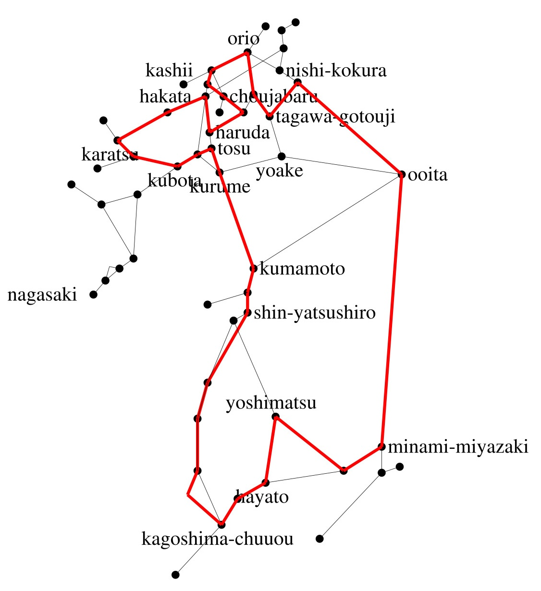
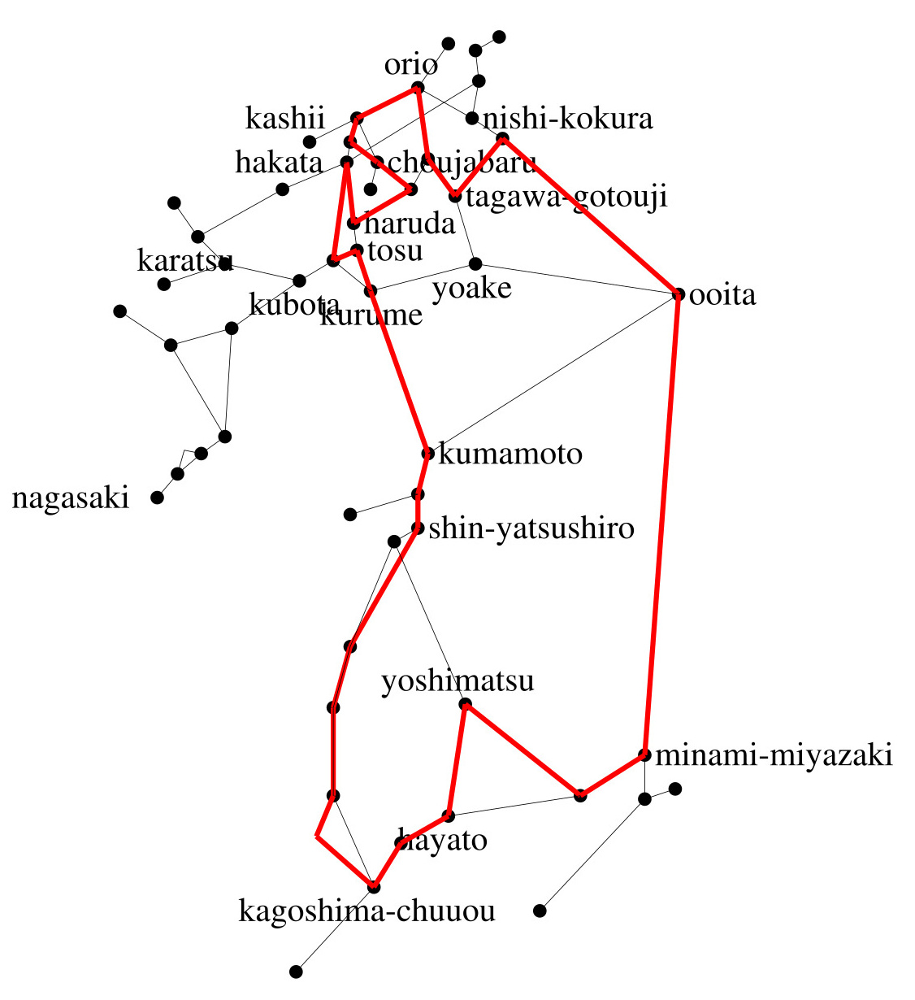

# 九州島内最長営業キロO型きっぷ・JR九州最長O型きっぷを求めたメモ （2025年1月版）

## 概要

* [JR九州の株主優待割引](https://www.jrkyushu.co.jp/company/ir/stock/shareholder/#anc01)を利用した最長O型きっぷを[求め](../jrkyushu-shareholder-incentive-longest-result-2022/)、[じっさいに購入し旅行した](https://youtu.be/zU2syk5mvfw)が、その翌年度から株主優待制度が大きく変更され、「株主優待最長営業キロO型きっぷ」は購入できなくなった
* さらにその後、日田彦山線が正式に部分廃止されたため、九州内の最長O型きっぷのルートが短縮されることとなった
* 現在、日田彦山線BRTを含むO型きっぷは発売されない
* そのため、従来の計算結果からBRT経路を省き、通過連絡運輸を含めた「九州島内最長O型きっぷ」と、含めない「JR九州最長O型きっぷ」の2つについて、2025年1月現在の経路を求めるものとする

## はじめに

[2022年のJR九州株主優待最長営業キロO型きっぷ](../jrkyushu-shareholder-incentive-longest-result-2022/)で考察し、現時点まで変更がない点はここでの説明を省き、差分のみを説明します。

## 3年間での状況の変換

### JR九州の株主優待制度が変更され、片道乗車券に適用することができなくなった

2023年度ぶんより、JR九州の株主優待制度が大きく改変されました。
これまでは「片道乗車券1枚、およびそれと同時使用する料金券何枚でも」が半額となる制度でしたが、単に「普通列車・快速列車に1日乗り放題」かつ「定価の料金券を組み合わせればすべての列車に乗車可能」というものとなりました。

これは、「発駅から着駅までの環状線一周の乗車」を証明する証券たるO型きっぷとはまったく異なるものです。

残念ながら、「JR九州株主優待最長営業キロO型きっぷ」は幻となりました。

### 日田彦山線BRTをO型きっぷの経路に含めることはできない

被災した日田彦山線 添田-夜明間が、2023年8月28日に「日田彦山線BRT」に転換され、同区間の鉄道営業は廃止されました。引き続き、JR九州直営の一般乗合旅客自動車運送事業として運行されていますが（運行は子会社のJR九州バスに委託（一部運行は日田バスに再委託））、乗車券の発売としては社線との連絡運輸のように扱われており、また通過連絡は設定されていません。よって、最長O型きっぷを作り得るのであれば、端点である添田、または夜明での発着となりますが、これらについて[ネット上の乗車券の画像](https://web.archive.org/web/20240810231503/https://www.tetsu-kiwa.net/hita-hikosan-brt-hikoboshi-line/)を見る限り、BRTの添田駅・夜明駅と、鉄道の添田駅・夜明駅は別の駅として扱われており、「環状線一周」の乗車券になっていないことになります（日田駅発着でも同様です）。

よって、日田彦山線BRTをO型きっぷの経路に含めることはできず、以後、日田彦山線の、他線と接続していない田川後藤寺-夜明間は、経路から除外して考えることとします。

## 以上を踏まえ、今回は2つの「最長O型きっぷ」のルートを計算する

まず、旧来の「JR九州株主優待最長営業キロO型きっぷ」は、社線通過連絡を含むO型きっぷという観点で、5割引はなくなりましたが、同じルートでそのまま「九州島内最長営業キロO型きっぷ」と呼び替えることができますので、日田彦山線BRT区間を除いて、再計算します。

また、それとは別に、JR九州での最長O型きっぷを、こちらは運賃軽鎖キロの最長で求めてみます。

### O型きっぷを発券可能な社線

こちらについては、[2022年時](../jrkyushu-shareholder-incentive-longest-result-2022/)と変化しておらず、以下のとおりとなります。（前述のとおり、日田彦山線BRTには通過連絡運輸の設定もなく、また接続駅のきっぷ券面表示が鉄道駅と異なっているため、O型きっぷをつくり得ません）

| No. | 社線 | 接続駅A | 設定範囲 | 接続駅B | 設定範囲 |
|:--:|:--:|:--:|:--:|:--:|:--:|
| 1. | 福岡市高速鉄道 | 博多 | JR東海・JR西日本・JR四国・JR九州 | 姪浜 | 筑肥線・唐津線| 
| 2. | 松浦鉄道 | 有田 | 佐賀-長崎・佐世保線・大村線 | 伊万里 | 筑肥線・唐津線 | 
| 3. | 肥薩おれんじ鉄道 | 八代 | JR九州 | 川内 | JR九州 | 

そして、松浦鉄道については計算不要であることも、変わりありません。

## 通過連絡可能な社線を含む営業キロ路線データ・JR九州の運賃計算キロ路線データ・地図データの作成

* [営業キロにもとづく路線データ](edges_kyushu_2025.csv)
* [運賃計算キロにもとづく路線データ](edges_jrkyushu_2025.csv)
* [地図データ(西九州新幹線が絡まないため、2022年版と同じ)](lopkyushu_2022.txt)

## ここまでの条件を実装する制約式

### 九州島内最長における、社線は1社に限ることの制約式

今回は、2線のいずれも枝は1本ですので、「その両者の総和は1以下」でことたります。

```
s.t. heur_operator_1: e920 + e921 <= 1;
```

### 経路特定区間の制約式は不要

最長O型きっぷ固有の特殊条件たる、「経路特定区間の中途の駅を発着駅とすることで、同規則の適用を回避し、キロ数を延ばすことができる」という案件は、経路特定区間がJR九州管内に存在しないため、今回は考察不要となります。

## 計算




計算結果は、当然ながら2022年版と同様に、*一瞬で*、それぞれ求まります。

- 九州島内最長: **福岡市高速鉄道を通過**する、**1080.3km**
- JR九州最長: **1006.7km**

前者については、2022年の株主優待最長に比して、日田彦山線BRT区間を通過しなくなり、営業キロが16.5km短縮となりました。
また、後者については、前者のルートの福岡市高速鉄道を通過する部分が、新鳥栖-博多間での九州新幹線利用で鳥栖-新鳥栖間のキロ程を稼ぐルートに変わり、それ以外は完全に前者と同一のルートとなっています。

## 特例の考察

特例については、2022年版とまったく変わらず、今回の2ルートにともに関係しないため、割愛します。

## 結論

以上により、九州島内最長営業キロO型きっぷの営業キロは**1080.3km**、JR九州最長運賃計算キロO型きっぷの営業キロは**1006.7km**ということになりました。

## 註記

### 途中下車の制限

JRの旅客連絡運輸規則によれば、この最長経路の乗車券において、途中の各駅での途中下車が可能となるはずです。しかし、同規則第76条第5号によれば「運輸機関が特に途中下車できない駅を指定した場合は、その指定した駅」という除外規定があり、かつ[福岡市高速鉄道連絡運輸規定第19条の2](https://www.city.fukuoka.lg.jp/d1w_reiki/reiki_honbun/q003RG00000937.html#e000000952)第2号ただし書きにおいて「ただし，高速鉄道区間に係る部分は，前途無効とする。」とされていることから、福岡市営地下鉄の途中駅では途中下車ができません。（リンク先が2022年版から変更されたため、記しました）

### 実乗キロの増量

計算上は以上のとおりですが、この条件を満たす最長O型きっぷを購入した上で、じっさいの乗車キロ数を増やす乗車方法は存在します。

* 西小倉-小倉間を、分岐駅通過特例または折り返し列車特例で複乗する（+1.6km）
* 久留米-筑後船小屋を、実キロが0.1km長い、九州新幹線に乗車する

今回は、実乗キロ最長ではなく営業キロ最長を前提として計算しており、*今回の結果＋特例利用が実乗キロ最長となるかどうかは証明されていない*ことにご留意ください。