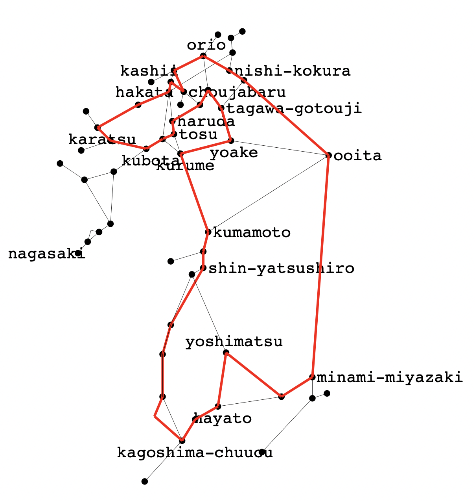

# JR九州株主優待最長営業キロO型きっぷを求めたメモ （2022年4月版）

## 概要

* [JR九州の株主優待割引](https://www.jrkyushu.co.jp/company/ir/stock/shareholder/#anc01)を利用した最長O型きっぷを求めたい
* JR九州の株主優待は、任意の自社線内で完結する片道乗車券のみならず、すべての連絡運輸についても適用可能であり、社線を経由することで最長キロを伸ばせる可能性がある
* O型きっぷに関しては、JR駅発着となるため、通過連絡運輸であれば社線を経由できることになる
* 通過連絡で経由する社線のキロ程は、JRのキロ程とは運賃計算上切り離されており、擬制キロをもって最長O型ルートを算出する意味がないので、営業キロ最長を算出したい
* 通過連絡運輸には、規則の解釈上の制約が2つあるが、JR九州を含む契約ではうち1つの「8の字乗車」については考慮不要であり、もう1つの「複数社連絡」については考慮する必要がある
* 旅客営業規則第69条「経路特定区間」は、JR九州管内には存在しないため、特例考慮は不要となる
* さらに、JR九州の路線網は、整数計画法を解く、というミッションにおいては、複雑なものではなく、特に工夫することなく、計算は一瞬で終了する

## 規則の考察

[JR最長](https://github.com/yonezawaizumi/lop-toolkit/tree/master/data/honshu-longest-result%E2%88%92202003/)の場合、規則の考察は「経路特定区間における制約式」以外では事前に行わず、計算結果を求めた後に考察を行いました。
しかし、本テーマにおいては「通過連絡運輸が可能な線区」を考察しない限りあらゆる計算が不可能であるため、規則や実運用上の問題点を先に考察しておくこととします。

### 問題１: O型きっぷを発券可能な社線

現在、通過連絡運輸に限らず、あらゆる連絡運輸の詳細については、旅客連絡運輸取扱基準規程別表（連基別表）が非公開資料とされてしまっています。

そこで今回は、二次資料としてもっともよくメンテナンスされている、[「ＪＲ 連絡運輸 取扱会社線一覧表」](http://mars.travel.coocan.jp/transfer.html)を参照させていただいた上で、これらのうちJR九州で利用可能な通過連絡を改めて調査することとしました。

ただし、同資料には、2019年に再設定された、肥薩おれんじ鉄道の通過連絡運輸が記載されていません。これについては、[昨年末にじっさいに発券し乗車できている](http://feelfine.blog.izumichan.com/category.php?k=2021-2022%E5%B9%B4%E3%81%AE%E5%B9%B4%E8%B6%8A%E6%97%85%E8%A1%8C+-+JR%E4%B9%9D%E5%B7%9EJIS%E3%82%B3%E3%83%BC%E3%83%89%E3%81%AE%E6%97%85%EF%BC%8B%E5%A4%B1%E3%82%8F%E3%82%8C%E3%81%9F%E5%B9%BD%E9%9C%8A%E6%96%87%E5%AD%97%E3%82%92%E6%B1%82%E3%82%81%E3%81%A6+%E8%A2%B0)ため、考慮します。

#### JR九州との通過連絡運輸を実施している線区

今回はJR九州の株主優待割引を利用するため、九州以外のJR各社の路線を経由することはありません。そのため、まず先述のページから、JR九州線と直接接続しかつ（JR九州を両端とし社線を通過する）通過連絡運輸を行う線区を、まず列挙します。

| No. | 社線 | 接続駅A | 設定範囲 | 接続駅B | 設定範囲 |
|:--:|:--:|:--:|:--:|:--:|:--:|
| 1. | 福岡市高速鉄道 | 博多 | JR東海・JR西日本・JR四国・JR九州 | 姪浜 | 筑肥線・唐津線| 
| 2. | 松浦鉄道 | 有田 | 佐賀-長崎・佐世保線・大村線 | 伊万里 | 筑肥線・唐津線 | 
| 3. | 肥薩おれんじ鉄道 | 八代 | JR九州 | 川内 | JR九州 | 

しょうじき、これしかありません。

かつては、松浦鉄道に「佐世保-伊万里」の設定があり、私も[それを利用したO型きっぷを発券し乗車したこともありました](http://feelfine.blog.izumichan.com/category.php?k=2012%E5%B9%B4GW%E3%81%AE%E6%97%85%E8%A1%8C+-+%E4%B9%9D%E5%B7%9E%E5%B3%B6%E5%86%85%E6%9C%80%E9%95%B7%EF%BC%AF%E5%9E%8B%E3%81%8D%E3%81%A3%E3%81%B7%E3%81%AE%E6%97%85PART1%EF%BC%8B%E6%9D%BE%E6%B5%A6%E9%89%84%E9%81%93%E9%80%9A%E9%81%8E%E9%80%A3%E7%B5%A1%EF%BC%AF%E5%9E%8B%E3%81%8D%E3%81%A3%E3%81%B7%E3%81%AE%E6%97%85%EF%BC%8B%E5%B3%B6%E5%8E%9F%E9%89%84%E9%81%93%E3%83%BB%E6%9D%BE%E6%B5%A6%E9%89%84%E9%81%93%E5%85%A8%E9%A7%85%E4%B9%97%E4%B8%8B%E8%BB%8A)が、2017年に廃止されたため、もうこの乗車券は不売となっています。

逆に、肥薩おれんじ鉄道の通過連絡は、JR九州の[観光特急36ぷらす3](https://ja.wikipedia.org/wiki/36%E3%81%B7%E3%82%89%E3%81%993)の運行開始＆一部座席を一般発売することとの整合性の確保から、2019年にあらためて設定されたものです。

なお、これらの社線において、現在は、途中駅での通過連絡運輸の接続駅の設定は存在しないため、[いわゆる「8の字問題」](https://github.com/yonezawaizumi/lop-toolkit/tree/master/data/jreast-shareholder-incentive-longest-result-2021)は考慮不要です。

また、JR九州株主優待割引は、JR線がJR九州内で完結していれば、旅客連絡運輸取扱基準規定別表にもとづく連絡乗車券への適用が可能であり、株主優待割引を行使することによる制約も存在せず、考慮不要です。

### 問題2: 2社以上の社線を通過することができないという制約

本件、制度鉄の間で、「規則解釈上の未確定問題」として語られることがある問題です。<br>
すなわち、「JRの旅客連絡運輸規則にも、取扱基準規程にも、『2社以上の社線を通過することはできない』という明文規程がないのだから、2社以上の社線の通過も可能ではないか？」というものです。

今回の取り組みで言えば、「上記の3とおりにある3社のうちの2社通過する連絡乗車券も発売可能なのではないか？」という設問に置き換えられるものとなります。

しかし、筆者は、この問題については、「2社以上の通過はできない」と解します。理由は[JR東日本株主優待最長営業キロO型きっぷを求めたメモ](https://github.com/yonezawaizumi/lop-toolkit/tree/master/data/jreast-shareholder-incentive-longest-result-2021)のとおりです。

以下の考察では、 *通過できる社線は上記の表のうちの1つのみとする* こととします。

### 考察1: 松浦鉄道は「特別扱い」してよい

以上の問題の検討結果を前提として、JR九州株主優待最長営業キロO型きっぷのルートの算出においては、松浦鉄道を「特別扱い」することができます。

なぜならば、JR九州における最長O型ルートでの通過連絡の利用では、社線との2つの接続駅における、JR線側の発売可能駅が、一致する必要があるからです。

肥薩おれんじ鉄道については、八代・川内ともに「JR九州内の各駅」であり、今回のテーマに沿ったルートは、任意の発着駅で可能です。
福岡市高速鉄道（福岡市営地下鉄（路面電車よりも高速なので「高速鉄道」））についても、博多駅でJR九州各駅、姪浜駅で筑肥線・唐津線各駅、であることから、後者の任意の各駅を発着駅とするO型きっぷを発券可能であるはずです。

しかし松浦鉄道においては、有田接続と伊万里接続の両方を満たす駅が、「佐賀-長崎間」かつ「唐津線」である、長崎本線久保田駅しかありません。すなわち、有田鉄道通過連絡運輸を利用したO型きっぷは、久保田駅発着しかありえず、久保田-伊万里は単一のルートしかなく、久保田-有田は長崎本線-大村線-佐世保線経由しか迂回経路がないため、その営業キロは 128.3（久保田-諫早-早岐-有田）＋13.0（有田-伊万里）＋58.6（伊万里-久保田）＝199.9kmである、と確定します。

これが、JR九州株主優待営業キロO型きっぷの最長ルートになり得ないことは自明です。なぜなら、熊本-鹿児島中央-西小倉-熊本というJR幹線のみの単純なO型ルートであっても、営業キロは820.3kmになるからです。

すなわち、通過連絡運輸として利用し得るのは、福岡市高速鉄道、肥薩おれんじ鉄道、の2社のいずれかのみ、ということになります。

###  考察2: JR規則と福岡市規程の矛盾による発着駅の制限

じつは、福岡市高速鉄道については、事業者たる福岡市が自治体であることから、運輸の条件については市条例および規程で決められかつ公開されていますが、なんと、[福岡市高速鉄道連絡運輸規程](https://www.city.fukuoka.lg.jp/d1w_reiki/reiki_honbun/q003RG00000937.html#e000001726)によると、通過連絡運輸の姪浜側の対象駅が「筑肥線各駅 〜 唐津線西唐津・小城間各駅」 とされており、唐津線久保田駅が除外されています。JR旅客連絡運輸取扱基準規程別表においては、線名の記載は「その線に属するすべての駅」が対象とされているため、久保田駅が含まれるはずなのですが、この矛盾…

本メモにおいては、じっさいの発着駅から久保田駅を除外することで、この問題を回避します。以下、特段の考察は行いません。

## 通過連絡可能な社線を含む路線データ・地図データの作成

* [営業キロにもとづく路線データ](edges_kyushu_2022.csv)
* [地図データ](lopkyushu_2022.txt)

## ここまでの条件を実装する制約式

### 社線は1社に限ることの制約式

今回は、2線のいずれも枝は1本ですので、「その両者の総和は1以下」でことたります。

```
s.t. heur_operator_1: e920 + e921 <= 1;
```

### 経路特定区間の制約式は不要

最長O型きっぷ固有の特殊条件たる、「経路特定区間の中途の駅を発着駅とすることで、同規則の適用を回避し、キロ数を延ばすことができる」という案件は、経路特定区間がJR九州管内に存在しないため、今回は考察不要となります。

## 計算



計算結果は、*一瞬で*、**福岡市高速鉄道を通過**する、**1096.8km**と出ました。

もちろんこの場合、福岡市高速鉄道通過連絡の発券条件を満たさなければならず、かつ前述の福岡市規程の問題があることから、保守的に考えると、**「小城〜唐津〜下山門間」のいずれかの駅が発着駅となります**。

## 特例の考察

最後に、特例について考慮します。

### 経路特定区間（旅客営業規則第69条、旅客営業取扱基準規程第109条）

JR九州管内には対象区間が存在しません。

### 電車大環状線（旅客営業規則第70条、旅客営業取扱基準規程109条）

JR九州管内には対象区間が存在しません。

### それ以外の、乗車券券面経路にかかわる特例

#### 特定都区市内(旅規86条)

限定された発着駅は、北九州市内でも福岡市内（筑肥線が除外されている）でもないため、影響しません。

#### 新大阪・大阪駅発着(旅規88条)、北新地発着(旅規89条）、新在別線原則の例外の例外(旅規64条4項3号)

JR九州管内には影響しません。

#### 大都市近郊区間内相互発着(旅規157条2項)

限定された発着駅は、福岡近郊区間にないため、関係ありません。

#### それ以外の特例

以下のものはすべて、最長ルートに関連する場合に限れば、乗車時に適用され得る特例であるため、乗車券発券時の最長ルートには関係しません。

* 選択乗車(旅規157条)
* 分岐駅通過(旅基151条)
* 折り返し列車(旅基152条)

また、以下のものは、JR九州管内での適用はないため、考慮不要です（特定分岐区間は、2022年3月12日、折尾駅高架化完了により、JR九州管内では適用区間がなくなりました）。

* 列車特定区間(旅基110条)
* 特定分岐区間(旅基149条) 

#### いわゆる日暮里・鶴見問題

デスクトップ鉄さん命名の[日暮里・鶴見問題](http://www.desktoptetsu.com/saichohensen.htm#nippori)については、JR九州管内では発生し得ません。

## 結論

以上により、JR九州株主優待券で割引可能な、営業キロ最長となるO型きっぷの営業キロ数は **1096.8km** となりました。

## 註記

### 途中下車の制限

JRの旅客連絡運輸規則によれば、この最長経路の乗車券において、途中の各駅での途中下車が可能となるはずです。しかし、同規則第76条第5号によれば「運輸機関が特に途中下車できない駅を指定した場合は、その指定した駅」という除外規定があり、かつ[福岡市高速鉄道連絡運輸規定第19条の2](https://www.city.fukuoka.lg.jp/d1w_reiki/reiki_honbun/q003RG00000937.html#e000000883)第2号ただし書きにおいて「ただし，高速鉄道区間に係る部分は，前途無効とする。」とされていることから、福岡市営地下鉄の途中駅では途中下車ができません。

### 実乗キロの増量

計算上は以上のとおりですが、この条件を満たす最長O型きっぷを購入した上で、じっさいの乗車キロ数を増やす乗車方法は存在します。

* 西小倉-小倉間を、分岐駅通過特例または折り返し列車特例で複乗する（+1.6km）
* 夜明-日田間を、分岐駅通過特例で複乗する（+17.0km）
  * 吉塚-博多、久保田-佐賀、城野-小倉は経路上に含まれず、利用不能
  * 宇土-熊本、田吉-宮崎は、O型となる経路では利用不能
* 久留米-筑後船小屋を、実キロが0.1km長い、九州新幹線に乗車する

今回は、実乗キロ最長ではなく営業キロ最長を前提として計算しており、*今回の結果＋特例利用が実乗キロ最長となるかどうかは証明されていない*ことにご留意ください。