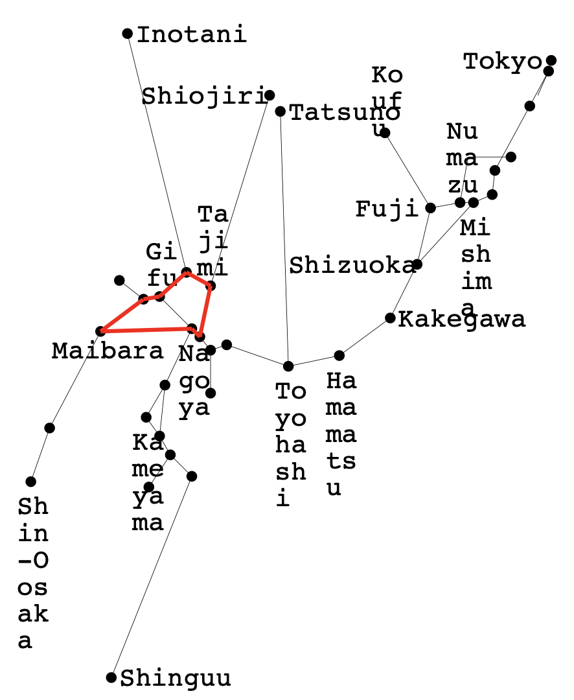

# JR東海株主優待最長営業キロO型きっぷを求めたメモ （2022年6月版）

## 概要

* [JR東海の株主優待割引](https://company.jr-central.co.jp/ir/stockholders/treatment.html)を利用した最長O型きっぷを求めたい
* JR東海の株主優待は、任意の自社線内で完結する片道乗車券のみならず、少なくとも伊勢鉄道の連絡運輸についても適用可能であり、社線を経由することで最長キロを伸ばせる可能性がある（いや、ないのだが…）
* O型きっぷに関しては、JR駅発着となるため、通過連絡運輸であれば社線を経由できることになる
* 通過連絡で経由する社線のキロ程は、JRのキロ程とは運賃計算上切り離されており、擬制キロをもって最長O型ルートを算出する意味がないので、営業キロ最長を算出したい
* 通過連絡運輸には、規則の解釈上の制約が2つあるが、JR東海を含む契約ではこれらを考慮する必要がない
* 旅客営業規則第69条「経路特定区間」は、JR東海管内には存在しないため、特例考慮は不要となる
* さらに、JR東海の路線網は、整数計画法を解く、というミッションにおいては、複雑なものではなく、特に工夫することなく、計算は一瞬で終了する（というか、手計算でも簡単だろこれ…）

## 規則の考察

[JR最長](https://github.com/yonezawaizumi/lop-toolkit/tree/master/data/honshu-longest-result%E2%88%92202003/)の場合、規則の考察は「経路特定区間における制約式」以外では事前に行わず、計算結果を求めた後に考察を行いました。
しかし、本テーマにおいては「通過連絡運輸が可能な線区」を考察しない限りあらゆる計算が不可能であるため、規則や実運用上の問題点を先に考察しておくこととします。

### 問題１: O型きっぷを発券可能な社線

現在、通過連絡運輸に限らず、あらゆる連絡運輸の詳細については、旅客連絡運輸取扱基準規程別表（連基別表）が非公開資料とされてしまっています。

そこで今回は、二次資料としてもっともよくメンテナンスされている、[「ＪＲ 連絡運輸 取扱会社線一覧表」](http://mars.travel.coocan.jp/transfer.html)を参照させていただいた上で、これらのうちJR東海で利用可能な通過連絡を改めて調査することとしました。

#### JR東海との通過連絡運輸を実施している線区

今回はJR東海の株主優待割引を利用するため、東海以外のJR各社の路線を経由することはありません。そのため、まず先述のページから、JR東海線と直接接続しかつ（JR東海を両端とし社線を通過する）通過連絡運輸を行う線区を、まず列挙します。

| No. | 社線 | 接続駅A | 設定範囲 | 接続駅B | 設定範囲 |
|:--:|:--:|:--:|:--:|:--:|:--:|
| 1. | 愛知環状鉄道 | 岡崎 | 浜松−刈谷 | 高蔵寺 | 中津川−勝川 | 
| 2. | 東海交通事業 | 枇杷島 | 枇杷島−大垣 | 勝川 | 中津川−勝川 | 
| 3. | 伊勢鉄道 | 河原田 | JR6社 | 津 | JR6社 | 

しょうじき、これしかありません。

ただしJR東海では、管内完結の通過連絡運輸はそもそもゼロであり、上記の3線はすべて、国鉄線もしくは国鉄の建設線が、分割民営化によって第3セクター分離されたもので、「むしろ増加している」とも言えます。

そして、これらのうち1.および2.は、2つの接続駅における共通の連絡範囲の設定が無いため、O型きっぷの発券が不可能であり、最長O型きっぷの経路に組み込み得る社線は伊勢鉄道のみ、ということになります。

このことから、他社や他パターンにおいて考慮しなければならない「複数社の社線を通過できるか？」問題、およびいわゆる「8の字問題」はいずれも発生し得ないため、考慮も不要ということになります。

また、JR東海株主優待割引は、JR線がJR東海内で完結していれば、少なくとも伊勢鉄道線を通過する連絡乗車券への適用が可能であり、株主優待割引を行使することによる制約も存在せず、考慮不要です。

## 通過連絡可能な社線を含む路線データ・地図データの作成

* [営業キロにもとづく路線データ](edges_jrtokai_2022.csv)
* [地図データ](loptokai_2022.txt)

## ここまでの条件を実装する制約式

### 社線は1社に限ることの制約式は不要

今回は、利用可能な社線が1社しか存在しないため、制約式は不要です。

### 経路特定区間の制約式は不要

最長O型きっぷ固有の特殊条件たる、「経路特定区間の中途の駅を発着駅とすることで、同規則の適用を回避し、キロ数を延ばすことができる」という案件は、経路特定区間がJR東海管内に存在しないため、今回は考察不要となります。

## 計算

計算結果は、*一瞬で*、**社線を通過しない**、**210.8km**と出ました。

なお、じっさいにO型乗車券を購入する場合、名古屋市内の駅を発着駅にすることができません（後述の特例の考察による）。

…本件、あまりに問題が平易であるため、なんの工夫もなく計算を行いましたが、よく路線図を眺めれば、そもそも伊勢鉄道線の通過連絡を利用したJR東海管内完結のO型の経路は亀山−河原田−津−亀山しかあり得ません。またそれ以外に存在するO型の経路も、富士−静岡−新富士−沼津−富士、岐阜−米原−岐阜羽島−名古屋−岐阜、岐阜−美濃太田−多治見−金山−名古屋−岐阜、そして計算結果、の4つしかありません。ので、この5つを手計算すれば、そもそもデータの準備に時間を要する本プログラムによる求解よりも、高速となるように思われます。orz

## 特例の考察

最後に、特例について考慮します。

### 経路特定区間（旅客営業規則第69条、旅客営業取扱基準規程第109条）

JR東海管内には対象区間が存在しません。

### 電車大環状線（旅客営業規則第70条、旅客営業取扱基準規程第109条）

JR東海管内には対象区間が存在しません。

### それ以外の、乗車券券面経路にかかわる特例

#### 特定都区市内(旅規86条)

JR東海管内には名古屋市が存在しており、これは今回の経路内に存在します。また今回の経路は200kmを超えるため、経路中の名古屋市内の各駅を発着駅とすると、同条ただし書きによる例外は今回の経路では用いることがでいないため、「名古屋市内→名古屋市内」という乗車券となってしまい、O型きっぷとは呼び難いものとなってしまいます。
よって、名古屋−新守山の各駅は発着駅とすることができず、それ以外の駅を発着する必要があります。

#### 新大阪・大阪駅発着(旅規88条)、北新地発着(旅規89条）、新在別線原則の例外の例外(旅規64条4項3号)

JR東海管内には影響しません。

#### 大都市近郊区間内相互発着(旅規157条2項)

JR東海管内には対象区間が存在しません。

#### それ以外の特例

以下のものはすべて、最長ルートに関連する場合に限れば、乗車時に適用され得る特例であるため、乗車券発券時の最長ルートには関係しません。

* 選択乗車(旅規157条)
* 分岐駅通過(旅基151条)
* 折り返し列車(旅基152条)

また、以下のものは、JR東海管内での適用はないため、考慮不要です。

* 列車特定区間(旅基110条)

なお、特定分岐区間(旅基149条) については、JR東海管内では金山−名古屋が指定されていますが、今回の経路ではこれを利用することはできません。

#### いわゆる日暮里・鶴見問題

デスクトップ鉄さん命名の[日暮里・鶴見問題](http://www.desktoptetsu.com/saichohensen.htm#nippori)については、JR東海管内では発生し得ません。

## 結論

以上により、JR東海株主優待券で割引可能な、営業キロ最長となるO型きっぷの営業キロ数は **210.8km** となりました。

## 註記

### 実乗キロの増量

計算上は以上のとおりですが、この条件を満たす最長O型きっぷを購入した上で、じっさいの乗車キロ数を増やす乗車方法は存在します。

* 岐阜−米原間で、実キロが2.9km長い、新垂井線経由となる特急の下り列車に乗車する
  * 米原−名古屋（または岐阜羽島）間では必ず新幹線特急料金を支払わねばならないが、こちらに株主優待割引を適用し、かつ、乗車する下り特急の特急料金を乗継割引適用の半額にすることで、いずれの特急料金をも割引とすることができる

今回は、実乗キロ最長ではなく営業キロ最長を前提として計算しており、*今回の結果＋特例利用が実乗キロ最長となるかどうかは証明されていない*ことにご留意ください。ただし今回については、結論だけ申せば、実乗キロ最長になっています（JR東海の管内における、前述の全5とおりのO型経路において、分岐駅通過特例・選択乗車・折り返し列車・列車特定区間・新幹線乗車による実キロ増加を使うことがいっさいできないため）。

### 株主優待割引を用いる意味

現実に、今回の経路において、運賃および名古屋−米原間の新幹線自由席特急券に株主優待割引を1枚適用した場合、割引額は380＋180＝560円です。これはJR東海の株主優待券を金券ショップ等で入手する場合のコスト、1枚700円〜1000円を下回ります。そもそもJR東海の株主である・株主の知人から無料で譲り受けた・同区間でグリーン車に乗る、などでない限り、*確実に損をすることになります*。笑