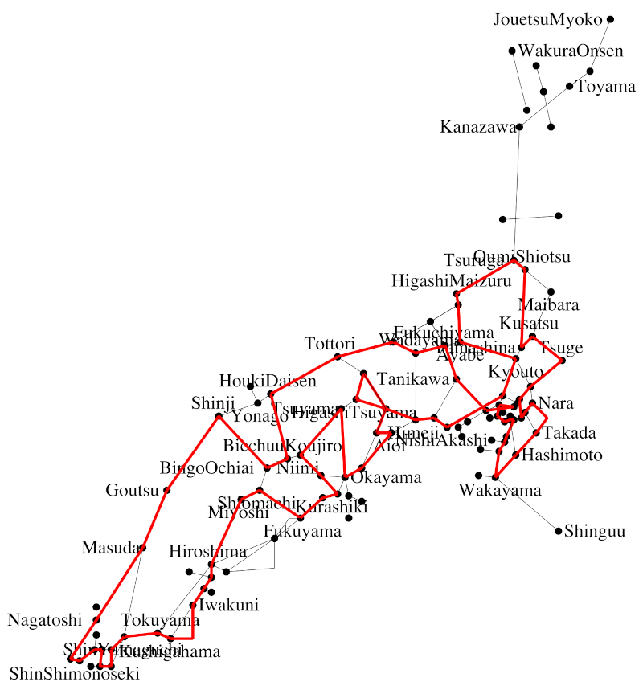
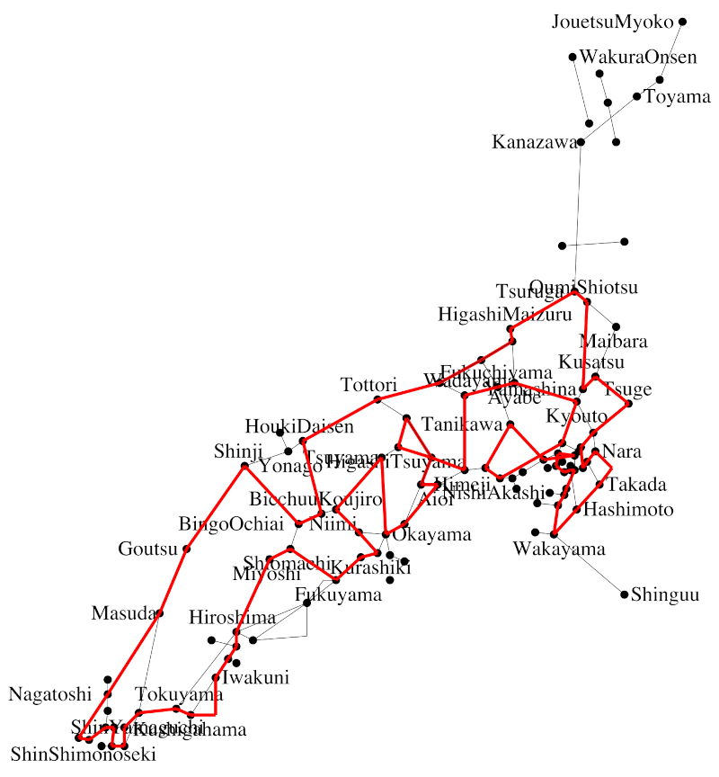

# JR西日本株主優待最長営業キロO型きっぷを求めたメモ （2024年3月版）

## 概要

* [JR西日本の株主優待割引](https://www.westjr.co.jp/company/ir/stock/shareholder/coupon/)を利用した最長O型きっぷを求めたい
* JR西日本の株主優待は、任意の自社線内で完結する片道乗車券のみならず、一部の連絡運輸についても適用可能であり、社線を経由することで最長キロを伸ばせる可能性がある
* O型きっぷに関しては、JR駅発着となるため、通過連絡運輸であれば社線を経由できることになる
* 通過連絡で経由する社線のキロ程は、JRのキロ程とは運賃計算上切り離されており、運賃計算キロをもって最長O型ルートを算出する意味がないので、営業キロ最長を算出したい
* ただし、通過連絡運輸には、規則の解釈上の制約が2つあるため、それらのすべてを考慮する必要がある
* さらにもちろん、JR西日本との間で通過連絡運輸が行われていたとしても、「JR西日本側に株主優待割引を適用可能なO型きっぷ」として発券できなければ意味がないため、その考察も必要となる

## 規則の考察

[JR最長](../honshu-longest-result%E2%88%92202003/)の場合、規則の考察は「経路特定区間における制約式」以外では事前に行わず、計算結果を求めた後に考察を行いました。
しかし、本テーマにおいてはそもそも「通過連絡運輸が可能な線区」を考察しない限りあらゆる計算が不可能であるため、規則や実運用上の問題点を先に考察しておくこととします。

### 問題１: O型きっぷを発券可能な社線

現在、通過連絡運輸に限らず、あらゆる連絡運輸の詳細については、旅客連絡運輸取扱基準規程別表（連基別表）が非公開資料とされてしまっています。

そこで今回は、二次資料としてもっともよくメンテナンスされている、[「ＪＲ 連絡運輸 取扱会社線一覧表」](http://mars.travel.coocan.jp/transfer.html)を参照させていただいた上で、これらのうち、接続駅の両端ともにJR西日本で利用可能な通過連絡を改めて調査することとしました。

#### JR西日本との通過連絡運輸を実施している線区

今回はJR西日本の株主優待割引を利用するため、西日本以外のJR各社の路線を経由することはできません。そのため、まず先述のページから、JR西日本線と直接接続しかつ（JR西日本を両端とし社線を通過する）通過連絡運輸を行う線区を、まず列挙します。

| No. | 社線 | 接続駅A | 設定範囲 | 接続駅B | 設定範囲 |
|:--:|:--:|:--:|:--:|:--:|:--:|
| 1. | 南海 | 新今宮 | 京都(市内)-神戸(市内)間、(おおさか東線：大阪市内に含まれる)、塚口-新三田間、関西本線、桜井線、片町線、和歌山線、阪和線、紀勢本線 | 橋本 | 関西本線、桜井線、片町線、和歌山線、阪和線、紀勢本線 | 
| 2. | WILLAR TRAINS | 福知山 | 全駅 | 西舞鶴 | 全駅 | 
| 3. | WILLAR TRAINS | 福知山 | 全駅 | 豊岡 | 全駅 | 
| 4. | WILLAR TRAINS | 西舞鶴 | 全駅 | 豊岡 | 全駅 | 
| 5. | 智頭急行 | 上郡 | 全駅 | 佐用 | 全駅 | 
| 6. | 智頭急行 | 上郡 | 全駅 | 智頭 | 全駅 | 
| 7. | 智頭急行 | 佐用 | 全駅 | 智頭 | 全駅 | 

* もともと通過連絡の設定は少ないJR西日本管内ですが、嵯峨野観光鉄道という壮絶な変わり種がなくなったのは残念です

#### 上記のうち、O型きっぷを設定可能な社線

上記の7とおりすべてに対し、O型きっぷは設定可能です。ただし南海に限り、発着駅の制限があります。

| No. | 社線 | 接続駅 | 設定範囲 | 
|:--:|:--:|:--:|:--:| 
| 1. | 南海 | 新今宮・橋本 | 関西本線、桜井線、片町線、和歌山線、阪和線 | 
| 2. | WILLAR TRAINS | 福知山・西舞鶴 | 全駅 | 
| 3. | WILLAR TRAINS | 福知山・豊岡 | 全駅 | 
| 4. | WILLAR TRAINS | 西舞鶴・豊岡 | 全駅 | 
| 5. | 智頭急行 | 上郡・佐用 | 全駅 | 
| 6. | 智頭急行 | 上郡・智頭 | 全駅 | 
| 7. | 智頭急行 | 佐用・智頭 | 全駅 | 

* 紀勢本線は、新今宮・橋本の両駅に対して連絡運輸の対象となっていますが、JR西日本の区間としては、全区間が新宮までの虫様突起線となり、O型きっぷのルートたりえません

#### うち、JR西日本運賃部分に株主優待割引を適用可能な社線

これらのすべてに対し、適用可能です。

* 嵯峨野観光鉄道については、適用不可だったようです

以上により、 *最長O型きっぷの計算の対象は、上記3社線、7とおりの組み合わせであることが確定しました* 。

### 問題2: 2社以上の社線を通過することができないという制約

本件、制度鉄の間で、「規則解釈上の未確定問題」として語られることがある問題です。<br>
すなわち、「JRの旅客連絡運輸規則にも、取扱基準規程にも、『2社以上の社線を通過することはできない』という明文規程がないのだから、2社以上の社線の通過も可能ではないか？」というものです。

今回の取り組みで言えば、「上記の7とおりにある4社のすべてを通過する連絡乗車券も発売可能なのではないか？」という設問に置き換えられるものとなります。

しかし、筆者は、この問題については「（青い森・いわて銀河は合わせて1社とみなした上での）2社以上の通過はできない」と解します。

この件についてもっとも説得力のある論証は、他ならぬ、本リポジトリーに収録したスクリプトの大元を開発した葛西さんが、「MMML（みどりの窓口メーリングリスト）」のアーティクル番号 07304 として投稿した文章にあります（以下に引用させていただきます）。

<details>

```
　「２社通過」をＮＧとする解釈の根拠は、連基別表の連絡運輸範囲の
記述であると私は理解しています。具体的には

	○○会社線を経由し、次の旅客会社線の左欄の各駅と右欄の
	各駅相互間

	経由運輸機関名｜
	及　び　区　間｜　　　　　旅　客　会　社　線
	－－－－－－－＋－－－－－－－－－＋－－－－－－－－－
	　○○会社線　｜北海道会社線　各駅｜北海道会社線　各駅
	　　　（＊１）｜西日本会社線　各駅｜西日本会社線　各駅
	　　　　　　　｜東　海会社線　各駅｜東　海会社線　各駅
	　　　　　　　｜西日本会社線　各駅｜西日本会社線　各駅
	　　　　　　　｜四　国会社線　各駅｜四　国会社線　各駅
	　　　　　　　｜九　州会社線　各駅｜九　州会社線　各駅

といった記載ですが（ここで「○○会社線」はＪＲ以外の路線をさす）、
ここの「経由運輸機関名及び区間」欄に「○○会社線」とだけ書いてあ
るので、「○○会社線」以外の社線を経由する場合はＮＧである、とい
う解釈です。

＃ 通過連絡の記述例だけを見るとこの解釈の妥当性が今ひとつ理解
＃ しにくいかもしれませんが、連基別表の他の例をあわせて読み、
＃ 現状と照らし合わせると、あながち無茶な解釈ではないと理解
＃ できると思います。
``` 

</details>

また、タカタカＢさんによる[複数の会社線通過となる連絡乗車券](http://blog.livedoor.jp/yosi44125/archives/51200901.html)という記事に、 *「連絡運輸契約書の中で、当社管内の連絡会社に限っては、何社（複数の通過連絡となる形態）であっても、連絡運輸契約を実施したものとして取扱うこととしています。」* とあるとおり、かつてJR西日本においては複数社を通過することを自社内に限り明示的に認めていたことが明らかとなっています。<br>
このことはすなわち、JR各社共通の解釈としては「複数社の通過は認めていない」ことの傍証となっています。<br>
また、同記事のとおり、現在この「基本事項」＝通達は削除されており、遅くとも2022年以降は、JR西日本への照会に対して「不可」との回答がなされた、との情報ばかりとなっています。

これらから、以下の考察では、 *通過できる社線は上記の表のうちの1つのみとする* こととします。

### 問題3: いわゆる8の字乗車問題（通過連絡経路の途中駅が連絡運輸の接続駅である場合、その途中駅をJRでも通過する場合は環状線一周とみなす、という謎制約）

そして通過連絡を利用する場合、JR線の片道経路には、明文化されていない謎ルールの適用があります。

かの種村直樹さんの2000年の著書[「新版　種村直樹の汽車旅相談室」（自由国民社）](https://www.amazon.co.jp/dp/4426548020/)の46ページに、「犀潟-ほくほく線-六日町-越後川口-飯山線-豊野、という通過連絡券の発売を拒否された」という相談事例があり、これについて種村さんが

1. 十日町駅はJR西日本と北越急行の連絡運輸の接続駅である
1. したがって両線の十日町駅は、同一駅とみなされる
1. その同一駅を2度る十日町駅で、運賃計算は打ち切られる

との回答（以下、「種村見解」とします。）を述べている、というものです。

しかし筆者は、この見解には **同意できません** 。

[旅客連絡運輸規則](https://railway.jr-central.co.jp/ticket-rule/carriage/_pdf/07.pdf)第16条第1項では、片道乗車券の運賃計算経路の打ち切りルールは旅規68条4項によるものとしていますが、同条項はJR線における環状線一周（または複乗）を定めたものです。さらに連規48条1項では、連絡運輸における片道運賃は旅客会社線と社線で別々に計算した額の併算であるとされており、社線の経路がJR線部分の運賃計算打ち切りの理由とならないことは明らかです。

ただし、種村さんの歴史的な存在意義や立ち位置、汽車旅相談室の歴史（「旅と鉄道」誌の長期連載）からして、この種村見解はJR各社の見解に準ずるものとして扱え得る重みはあります。

そしてなによりも、筆者は2007年7月およｂ2024年3月に本件についてJR西日本に照会をしており、2度ともに「佐用で打切計算」との回答をいただいております。

そこで今回は、「8の字乗車は認められない」という立場で最長ルートを計算することを基本とし、補足として8の字乗車のルートも計算することとします。

なお、本件で対象となる、この問題が生じ得る駅は、智頭急行の佐用駅です。

## 通過連絡可能な社線を含む路線データ・地図データの作成

* [路線データ](edges_jrwest_thru_2024.csv)
* [地図データ](lopjrwest2024.txt)

これらは[JR最長](https://github.com/yonezawaizumi/lop-toolkit/tree/master/data/honshu-longest-result%E2%88%92202003)で用いた西日本用データを加工したものです。

### 運賃計算キロから営業キロへの変更

文字どおりです。

### 通過連絡可能な社線、およびそれに接続する（JR最長では不要だった）JRの枝線を追加、JR側で分断される路線データの分割

営業キロ最長の算出ですので、社線の営業キロを追加します。<br>
また、たとえば南海を追加することにより、たとえば和歌山線の高田-和歌山間に橋本駅を追加し、2路線に分割する必要があります。

### 8の字乗車対応のためのダミー線追加

しかし、上記のようにして社線を収容すると、JR線と社線との接続点は単なる頂点となるため、8の字乗車を許す場合、最長O型を求めるロジックでは計算ができなくなってしまいます。

> O型は「すべての頂点に接続する枝の使用数が0または2である」という制約式で整数計画法を解きますが、8の字乗車の場合の交差駅の枝の使用数は4になるため、そもそも制約式が変化します。

今回はこれも単純なO型として解くため、以下のような路線データ・地図データを作成しています。

* 智頭急行のうち、智頭-佐用を枝 `e615` 、佐用-上郡を枝 `e616` とするが、その他に智頭-上郡というダミー枝 `e617` を追加する

```
615,256,257,389,615,智頭急行,智頭→佐用
616,257,260,172,616,智頭急行,佐用→上郡
617,256,260,561,617,智頭急行,智頭➡上郡
```
* 地図データにも、`e615` および `e616` のデータを追加した後、その両者を `e617` のデータとしても定義する

```
L,256,257,615,0
L,256,257,617,0
L,257,260,616,0
L,257,260,617,0
```

この路線データによって、8の字乗車を認める場合は、「 `e615` 、`e616` 、`e617` のうちいずれか1つを通過するか、いずれも通過しない」ことで、「 `e617` を通過しかつ姫新線も通過する」場合でも両者の交点が無い条件で計算ができることになります。<br>
また、それぞれの枝の地図線も意図通りに描画できることになります。

## ここまでの条件を実装する制約式

### 通過連絡が設定されていない区間、重複区間を禁止する制約式

智頭急行については、ダミー線との重複利用を禁止する必要があります。

```
s.t. chizu_dummy_1: e615 + e617 <= 1;
s.t. chizu_dummy_2: e616 + e617 <= 1;
```

### 社線は1社に限ることの制約式

もしすべての社線の枝が1本ずつなのであれば、「総和が1以下」で済みますが、複数線、さらに8の字用線の重複もあるため、複数の式で表現することになります。

すなわち、南海・WILLAR・智頭急行の3社のうち1社のみを通過するということになりますので、そのすべての組み合わせに対し「総和が1以下」であることを列挙すれば十分です。

```
s.t. companies_611_612_615: e611 + e612 + e615 <= 1;
s.t. companies_611_613_615: e611 + e613 + e615 <= 1;
s.t. companies_611_614_615: e611 + e614 + e615 <= 1;
s.t. companies_611_612_616: e611 + e612 + e616 <= 1;
s.t. companies_611_613_616: e611 + e613 + e616 <= 1;
s.t. companies_611_614_616: e611 + e614 + e616 <= 1;
s.t. companies_611_612_617: e611 + e612 + e617 <= 1;
s.t. companies_611_613_617: e611 + e613 + e617 <= 1;
s.t. companies_611_614_617: e611 + e614 + e617 <= 1;
```

### 8の字乗車を禁止する制約式

前章で、8の字通過用のダミー線を用意することで通常のO型ルートとして解くことができるようにしましたが、種村見解を採用する場合は、これは禁止する必要があります。

禁止の方法は簡単で、ダミー線の通過を禁止すれば、佐用は通常の頂点となり、O型ルートの計算で自動的に8の字が除外されます。

```
s.t. disable_8_figure_chizu: e617 = 0;
```

### 経路特定区間の制約式

さいごに、JR最長における考察のメインであった、旅客営業規則第69条・経路特定区間について、いったんすべてを禁止して求めることにします。

JR西日本管内における経路特定区間は、6〜9号の4パターンがあります。

| 号 | 乗車区間 | 短い経路 | 長い経路 | 営業キロ差 |
|:--:|:--:|:--:|:--:|:--:|
| 6 | 山科-近江塩津 | 湖西線 `e270` | 東海道・北陸<br> `e267 + e271 + e272` | 19.5km |
| 7 | 大阪-天王寺 | 東回り<br> `e300 + e303` | 西回り<br> `e307 + e602` | 0.3km |
| 8 | 三原-海田市 | 山陽 `e362` | 呉線 | 22.0km |
| 9 | 岩国-櫛ケ浜 | 岩徳 `e368` | 山陽 | 21.4km |

これらのうち6・7号については、以下の制約式の追加が必要です。

```
s.t. kosei_hokuri_limitation: e269 + e271 + e272 <= 2;
s.t. osaka_kanjou_limitation: e602 + e307 - e300 - e303 <= 1;
```

なおこの制約式は、 [旅客営業取扱基準規程](http://www.desktoptetsu.com/ryoki/kijunkitei.htm) 第109条の「2度通過」を巧妙に回避する表現となっております。詳細は[JR最長O型での解説](../honshu-longest-result%E2%88%92202003/README.md)  をお読みください。

また、8・9号については、両線ともに途中駅での分岐が存在しないため、 *「両線のみの利用でO型ルートを構成する」以外にO型ルートを採り得ません* 。これについては、 *路線データの営業キロを直接短い方に書き換えて計算することとします* 。

## 計算

8の字禁止・ありのいずれも、計算はほぼすぐに完了します。

<blockquote>やはりJR東日本の複雑な首都圏の路線網がなければ、問題は複雑ではない、ということのようです。</blockquote>

8の字禁止の場合、以下の経路が、社線を1度通過し、かつ **経路特定区間を全区間に適用した場合の** 最長O型ルートとなります（ただし、地図の設定をサボっているため、この画像では「岩国−櫛ケ浜間を山陽本線経由にしている」ことになっていますが、計算は岩徳線経由で行っております）。
WILLAR TRAINS（京都丹後鉄道）を豊岡-西舞鶴で通過利用し、営業キロ 2419.8km です。


参考までに、8の字許容の場合は、以下の経路が、社線を1度通過し、かつ **経路特定区間を全区間に適用した場合の** 最長O型ルートとなります（地図の注意は上と同じ）。
智頭急行を通過利用し、佐用で環状線一周のように見える経路で、営業キロ 2476.7km です。



なんというか、やっぱり8の字を許容すると、ルートは延びるわけですね…。

### 経路特定区間を適用させないことの検討

そして、経路特定区間を回避することで、営業キロを延ばすことを、以下、考察していきます。

8の字禁止・許容ともに、経路特定区間を通過しているのは、9号、岩国-櫛ケ浜間となります。

<blockquote>なお、6号、山科-近江塩津については、いずれのルートでも、近江塩津-山科間を通過はしているものの、その後山下-草津間で他方の経路を通っているため、旅客営業取扱基準規程第109条に基づき、経路特定区間は適用除外となります。</blockquote>

この経路において、南岩国-下松間を発着駅とすれば、片道乗車券の経路としては経路特定区間を「通過していない」ために適用除外となり、長い山陽本線経由での運賃計算を行えるようになります。
すなわち、発着駅の制限により、営業キロはそれぞれ 2441.5km 、 2498.4km ということになります。

これに対し、他の3つの経路特定区間において、「長い経路を通過する」経路での計算を行い、結果を比較することで、真の最長ルートを計算することができます。

これらについて、それぞれの制約式の変更は、以下のとおりです。

| 号 | 乗車区間 | 制約式の変更 |
|:--:|:--:|:--:|
| 6 | 山科-近江塩津 | `e269 + e271 + e272 = 3;` かつ `e270 = 0;` |
| 7 | 大阪-天王寺 | `e602 + e307 = 2;` かつ `e300 + e303 = 0;` |
| 8 | 三原-海田市 | `e362 = 1;` かつ この枝の営業キロを呉線の `870` とする |

6号と7号は「長い方のみを通過する」という制約式となります。
また8号は、単純に「短い方を必ず通過」したうえで、短い枝のキロ数を長いほうにして計算すればよいことになります。

### 経路特定区間を考慮した計算の結果

すべての設定をそれぞれ手動で差し替え、自動で計算した結果のみを、以下にまとめました。

| 号 | 乗車区間 | 8の字禁止 | 8の字許容 |
|:--:|:--:|:--:|:--:|
| 6 | 山科-近江塩津 | 2310.1km | 2378.5km |
| 7 | 大阪-天王寺 | 2410.8km | 2467.7km |
| 8 | 三原-海田市 | 2381.9km | 2438.8km | 
| 計算済みの 9 | 岩国-櫛ケ浜 | 2441.5km | 2498.4km |

この結果、先に求めた、9️号で経路特定区間を回避するルートが、8の字禁止・許容のいずれでも、最長であることがわかりました。

## 特例の考察

最後に、特例について考慮します。

### 経路特定区間（旅客営業規則第69条、旅客営業取扱基準規程第109条）

前章で考察済みです。

### 電車大環状線（旅客営業規則第70条、旅客営業取扱基準規程109条）

JR西日本管内には設定されていません。

### それ以外の、乗車券券面経路にかかわる特例

以下のとおり、計算上の再考の必要はありませんが、じっさいに乗車券を購入する場合、片道乗車券の発着駅の制限が発生し得るため、いちおう考察します。

#### 特定都区市内(旅規86条)

経路特定区間を考慮した結果、発着駅は南岩国-櫛ケ浜間に限られるため、関係しません。

#### 大都市近郊区間内相互発着(旅規157条2項)

明らかに相互発着ではないため、関係ありません。

#### 新大阪・大阪駅発着（旅客営業規則第88条）、北新地発着（旅客営業規則第89条）

経路特定区間を考慮した結果、発着駅は南岩国-櫛ケ浜間に限られるため、関係しません。

#### 新在別線原則の例外の例外(旅規68条4項3号)

新下関-博多間の山陽新幹線を経由していないため、関係しません。

### それ以外の特例

以下のものはすべて、最長ルートに関連する場合に限れば、乗車時に適用され得る特例であるため、乗車券発券時の最長ルートには関係しません。

* 選択乗車(旅規157条)
* 列車特定区間(旅規70条の2 2項)
* 特定分岐区間(旅規160条の2)
* 特定都区市内折り返し(旅規160条の3)
* 分岐駅通過(旅規160条の4)
* 海田市-広島折り返し(旅規160条の5)
* 折り返し列車(旅規160条の6)

#### いわゆる日暮里・鶴見問題

デスクトップ鉄さん命名の[日暮里・鶴見問題](http://www.desktoptetsu.com/saichohensen.htm#nippori)については、JR西日本管内には関係しません。

## 結論

以上により、JR西日本株主優待券で割引可能な、営業キロ最長となるO型きっぷのキロ数は、8の字乗車を禁止した場合 **2441.5km** 、8の字許容の場合は **2498.4km** となりました。

## おまけ

最大限、黒に近いグレー解釈を総動員した経路、すなわち

- 複数社の通過連絡を利用可能
- 8の字通過連絡の許容

にもとづいた最長O型経路も、いちおう計算してみたところ、結果は、以下のとおりの、南岩国-下松間を発着駅とした場合の、営業キロ 2610.4km となりました（笑）


