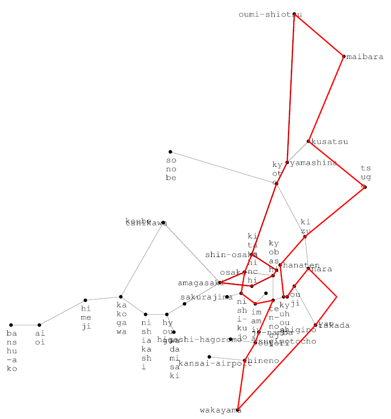

# 2023年3月17日現在の実乗可能な大阪近郊区間内最長O型大回りルートを求めたメモ

## 概要

* 大阪近郊区間相互発着の最長の実乗キロ数となるO型ルートを求め、そのルートに乗車可能な最短のO型きっぷを購入しじっさいに乗車したい
* すなわち、乗車キロ数を増やせる特例を駆使してルートを選定したい
* いっぽうで、特例が設定されていても、現実にその特例を用いたルートにじっさいに乗車することができなければならず、**時刻表にも依存した考察が必要となる**
* 「実乗キロ数」は、営業キロでも運賃計算キロでもなく、**0.1km単位で設定されている実キロに基づいて計算する**
* 今回、過去の考察においては計算式に組み込まずに個別考察を行ってきた、**乗車時に適用可能な各種特例について、計算式に組み込んでみた**
* なお、今回得られたルートをO型きっぷで乗車する場合、分岐駅通過特例の双方の駅を発着駅とすることは、避けたほうが無難である

## 【初心者向けまとめ】「大都市近郊区間大回り」とは？

* [旅客営業規則第157条第2項](https://www.jreast.co.jp/ryokaku/02_hen/04_syo/02_setsu/11.html)により、[全国のJR路線網の中に5箇所設定されている「大都市近郊区間」](https://www.jr-odekake.net/railroad/ticket/guide/normal_tickets/special_provisions06.html)の内部で相互発着する乗車については、利用する普通乗車券または回数乗車券の券面記載経路以外の経路を選択して乗車する（選択乗車）ことができる
  * 大都市近郊区間を定める条文は[旅客営業規則第156条第2号](https://www.jreast.co.jp/ryokaku/02_hen/04_syo/02_setsu/02.html)である
* この原則を用いて、主に最短ないし最安値となる経路の乗車券を購入して、それよりも長くなる経路でじっさいに乗車することを、通称「大回り」と呼ぶ
* 大都市近郊区間大回りの場合、乗車券のルールの原則とは異なる、以下の定めが適用される
  * 乗車券の有効期限は1日である（[旅規154条1号イ](https://www.jreast.co.jp/ryokaku/02_hen/04_syo/02_setsu/index.html)）
  * 途中下車はできない（[旅規156条2号](https://www.jreast.co.jp/ryokaku/02_hen/04_syo/02_setsu/02.html)）
  * 選択乗車中の途中駅で下車した場合、権利放棄はできず、じっさいの乗車経路と券面運賃額との差額精算になる（[旅規157条3項](https://www.jreast.co.jp/ryokaku/02_hen/04_syo/02_setsu/11.html)）
* 前項の条件により、大回りをじっさいに行う場合、その経路に、初電から終電までの間に、（乗換で必要な場合以外には）改札を出ずに乗車し切らなければならない
* なお、本件と類似のものに「ICカード乗車券大回り」があるが、規則の考え方そのものが異なるため、同じような大回りが可能ではあるものの、根拠や扱いには大きな差がある

## 実乗キロ数を増やすための関連規則の考察

現在のJRの旅客運賃制度において、実乗キロを増やす＝片道乗車券の乗車ルートに含まれない区間に別途の運賃を支払わずに乗車する（区間外乗車）ことを認めている特例には、以下のものがあります。

1. 選択乗車（旅規157条）
2. 特定分岐区間（旅基149条）
3. 分岐駅通過（旅基151条）
4. 折り返し列車（旅基152条）

これらについて考察しましょう。

### 選択乗車

本件は今回は関係しません。なぜなら、そもそも大回りじたいが選択乗車の利用であるからです。

### 特定分岐区間

旅客営業取扱基準規程第149条によると、大阪近郊区間内では、以下の区間において、示された乗車経路での区間外乗車が認められています。

- 今宮又は芦原橋以遠（大正方面）の各駅と、JR難波駅との相互間（今宮・新今宮間）

しかし、この区間は、今回のテーマでは考察が不要です。なぜなら、この特例は、JR難波駅と今宮以遠の各駅との乗車時に利用できるものであり、JR難波駅は路線の終端ですので、O型きっぷの経路に含めることができないからです。

### 分岐駅通過

旅客営業取扱基準規程第151条第3項によると、旅規157条2項、すなわち大回りの根拠そのものによる乗車中において、大阪近郊区間内では、以下の区間に特例が設定されています。

- 山科・京都間
- 新大阪・大阪間
- 大阪・新大阪間
- 尼崎・大阪間

これらは、規程の条文上、左方の駅より分岐するいずれかの区間から入り、右の駅で折り返して、左の駅の別の分岐へと出ていく乗車が、左の駅を往路または復路で通過する列車に乗車した場合（かつ右の駅で途中下車をしなかった場合）に、利用できるものです。これらはすべて、計算に組み込むことにします。

### 折り返し列車

旅客営業取扱基準規程第152条によるこの特例ですが、大阪近郊区間内には指定区間がないため、考慮不要です。

以上により、分岐駅通過の特例のみを、今回の計算に組み込む必要があることになりました。

## 実キロの準備

今回の計算では、「じっさいに乗車したキロ数」を最長にすることにしました。

これは、特例を駆使して乗車キロ数を伸ばす以上、「実際のキロ数」に近づけた計算結果を得たい、からです。
ただし、メートル単位の建設時のデータまでを利用して計算することには意味がないと考えます。列車の編成は短くても20m以上あり、その車内を歩いてうろついたような場合にデータの精度の意味が問われてくるからです。
そこで、営業キロと同様に0.1km単位で言及されることがある「実キロ」を計算に用いることとします。

### 両者が異なる場合(1) 新幹線

「実キロ」は、古くは国鉄の「営業線基準規定」により定められた「営業キロの計算ルール」そのもので求められるものです（そしてそれは、じっさいに建設されたキロ数である「建設キロ」ともまた異なるところはややこしい）。
ただし法規上の「営業キロ」は、この計算結果すなわち「実キロ」とは異なる値に設定されることがあります。
典型的には、新幹線です。新幹線の実キロはおおむね在来線よりも短くなっており、しかしその実キロで運賃を定めると在来線時代よりも運賃が安くなってしまうため、「新幹線は在来線の別線線増だから」という理由で在来線の営業キロをそのまま利用しました。このことで利用者から起こされた有名な訴訟、[新幹線運賃差額返還訴訟](https://ja.wikipedia.org/wiki/%E6%96%B0%E5%B9%B9%E7%B7%9A%E9%81%8B%E8%B3%83%E5%B7%AE%E9%A1%8D%E8%BF%94%E9%82%84%E8%A8%B4%E8%A8%9F])があり、一審では国鉄が敗訴しましたが、上級審では国鉄が逆転勝訴し、「営業キロと実キロの差異は許認可の裁量の範囲内である」という判例となりました。その結果現在でも、両者が異なる区間は新たに生まれることがあります。

そして今回の大阪近郊区間では、京都-新大阪間でこれが発生します。
京都-新大阪は、在来線の営業キロは39.0kmですが、東海道新幹線は新大阪から直接西をめざすために線形が曲げられた結果、実キロは39.1kmとなっています。しかも、（米原-）京都-新大阪間は現在でも大阪近郊区間に含まれている（歴史的には当初は新幹線の全区間が含まれ、78年を皮切りに徐々に減らされている）ため、大阪近郊区間大回りにおいては、別途新幹線特急券の購入併用により新幹線への乗車が可能です。
これにより、同区間を通過する場合は、常に新幹線に乗車することで、乗車するキロ数を0.1km延ばすことができます。

### 両者が異なる場合(2) 短絡線の走行

かつて貨物専用線だった路線に旅客列車を走らせることは、今も昔も行われています。東京近郊区間にも、湘南新宿ラインの大崎-西大井間において、じっさいの走行は旧蛇窪信号場で横須賀線と合流するところ、運賃計算上の営業キロは「大崎-品川-西大井」として計算します。すなわちこの場合は「実キロが営業キロよりも短くなる」ことになります。

今回の大阪近郊区間では、梅田貨物線経由の列車がこれに相当します。
梅田貨物線の営業キロと実キロは各区間ともに一致していますが、新大阪-梅田間は新大阪-大阪間と同一であり、いっぽう梅田-福島間は大阪環状線の大阪-福島よりも0.1km短くなっています。よって、梅田貨物線経由の列車の走行経路の実キロは、運賃計算上の営業キロよりも0.1km短くなることになります。
そして、これだけなら「梅田貨物線は経由したら損だから通過しない」となりそうですが、後述する特例の利用により、**梅田貨物線経由とすることで逆に実乗キロ数が延びる場合がある**のです。そのため、実乗キロ最長の計算では、この-0.1kmの実キロの考慮が必要となります。

## 以上に基づくデータの準備

* [営業キロにもとづく路線データ](edges_osaka_20230317.csv)
* [地図データ](osaka_20230317.txt)

今回用意したデータには、次の工夫があります。

### 実キロの設定

まず、大阪近郊区間内の地方交通線である、桜井線・和歌山線・加古川線については、運賃計算用の換算キロではなく、営業キロを設定しました。
また、京都-新大阪間では、実キロが長い東海道新幹線を常に利用することとし（東海道本線との重複利用は片道乗車券の条件を満たさず不能）、キロ数に`391`を設定しています。

### 分岐駅通過特例を表現するダミー線の準備

たとえば、「尼崎-大阪」について、関連する路線データを上記CSVファイルから引用します。

```
66,236,245,1009,905,尼崎-大阪分岐駅通過特例1,京橋→大阪→谷川
66,236,248,533,906,尼崎-大阪分岐駅通過特例2,京橋→大阪→神戸
66,245,248,1138,907,尼崎-大阪分岐駅通過特例3,谷川→大阪→神戸
```

この3つのダミー線は、現実にこの分岐駅通過特例を利用するために可能なルートを考えたものです。「左の駅」＝尼崎駅から大阪に向かい、かつ「尼崎駅を通過する列車に乗車する」ルートは、現行ダイヤを無視すれば、以下の3パターンあります。

- 京橋(JR東西線)尼崎(東海道本線)大阪(東海道本線)尼崎(福知山線)谷川
- 京橋(JR東西線)尼崎(東海道本線)大阪(東海道本線)神戸
- 谷川(福知山線)尼崎(東海道本線)大阪(東海道本線)神戸

ですので、これら3パターンについて「分岐駅通過特例を利用した場合にのみ利用可能な経路」をダミー線として設定し、そのキロ数には全区間の実キロを指定すればよい、ということになります。

そして、この「実キロ」で、梅田貨物線が登場します。

```
128,235,236,227,903,大阪-新大阪分岐駅通過特例1,天王寺→新大阪→京橋
```

この「天王寺(関西本線)今宮(大阪環状線)大阪(東海道本線)新大阪(東海道本線)大阪(大阪環状線)京橋」という分岐駅通過特例を利用するルートにおいて、大阪駅の配線の都合上、「大阪駅を通過して新大阪に向かう列車」はまさに梅田貨物線を経由するもののみです。ですので、この場合は「天王寺-今宮-福島」と「大阪-新大阪-大阪-京橋」の営業キロに、「福島-大阪」の実キロを加えた22.7km、すなわち`227`を指定することになります。

なお、もちろん、これらの路線データをスクリプトに焚べただけでは、これらのダミー線と本来の路線を重複利用するイリーガルなルートがいくらでもできてしまうため、制約式を別途追加しなければなりません。それは後述します。

### 地図データの準備

そして、上記で設定したダミー線を、結果の地図に描画させるため、地図データも用意する必要があります。

上記の「尼崎-大阪分岐駅通過特例1,京橋→大阪→谷川」に対応する地図データを引用します。

```
L,236,237,905,0
L,237,244,905,0
L,239,244,905,1
L,244,245,905,1
```

元からの地図データのうち、JR東西線の京橋-北新地-尼崎、特例の尼崎-大阪、尼崎を通過して神戸まで、の4データをコピーし、路線番号を`905`に置き換えただけです。

なお、このような簡易な設定としたため、地図の描画ロジックにより、求められた結果の経路の赤線の上に黒線が描画されたりされなかったりします。もちろんこれは、路線は経由していなくても黒線で描画されるためで、赤線のあとに黒線が描画されている区間が一部に現出してしまいます。
またもう1点、特例で経由した区間を同じ赤色で描画したことで、2つの特例が重複する新大阪-大阪については、地図を見ただけでは「どちらの特例」なのかがまったくわからない、という現象も起こり得ます（ただし現実のダイヤに基づけば、今回はその混乱は生じない（後述））。

このあたりは、申し訳ありませんが、本toolkitでは改修する予定はありません。あくまでも「これを動かせる人が見てわかればよい」ということで。
（同様に、日本語が表示できない問題、一部ゴミが描画される問題についても、改修の予定はありません）

## ダミー線に対する制約式の追加

以上のデータで、 `bash autoo.sh osaka_20230317 osaka_20230317.txt` を実行すると、結果として異常なものが出力されます。
まさに、前章で触れた「イリーガルなルート」を経由してしまったわけです。

そこで、「ダミー線の重複を排除する」ための制約式の追加が必要となります。

### ダミー線に含まれる分岐側の路線と、ダミー線の重複利用を認めない

たとえば、前述の「京橋(JR東西線)尼崎(東海道本線)大阪(東海道本線)尼崎(福知山線)谷川」であれば、このダミー線 == `e905` と、JR東西線 == `e302` および福知山線 == `e314` のいずれも重複してはならないので、

```
s.t. amagasaki_1_1: e905 + e302 <= 1;
s.t. amagasaki_1_2: e905 + e314 <= 1;
```

という制約式を追加する必要があります。

### 特例で重複乗車する区間と、それを含むすべてのダミー線の重複利用を認めない

まず、分岐駅通過特例のダミー線とじっさいの重複乗車区間の双方を通過することはできません。たとえば「大阪-新大阪」の特例を利用する場合、少なくとも大阪駅を、大阪-天王寺および大阪-尼崎の2区間で通過しているので、さらに大阪-新大阪に特例抜きで乗車することは、大阪駅から出る3路線に乗車することになってしまい、トポロジー的に不可能です。
しかし、ダミー線はあくまでも、「ダミー線の両端の駅しか通過していない」ように、数式上、（整数計画法ソルバーには）見えています。ですので、このことについての明示的な制約式の追加が必要です。

このことは、

```
s.t. oosaka: e903 + e904 + e305 <= 1;
```

のように平易に表すことができます。この特例は2種類のダミー線で可能性があり、それとじっさいの路線の合わせて3線のうち、通過するのはたかだか1線ですので、総和は0か1、すなわち1以下となります。

### 尼崎-大阪には特別な対応が必要

そして、前項と同様に、「異なる特例に対するダミー線どうしが、じっさいに重複してしまう」ことの考慮も必要です。
「尼崎-大阪」のダミー線について、「大阪-新大阪」の特例のダミー線のうちの「天王寺-新大阪-尼崎」となるダミー線は、重複が許されません。このダミー線は、O型ルートのため尼崎から先が必ずあり、それは神戸か谷川。そしてこのいずれも、「尼崎-大阪」のうちの2つのダミー線に含まれていますので、重複の排除が必要です。

```
s.t. oosaka_amagasaki: e904 + e906 + e907 <= 1;
```

という、この3つのダミー線のうち、有効なものは1線以下である、という制約式が必要です。

### ダイヤ上の制約：じっさいに分岐駅通過特例が適用されうる列車が運行されていないことへの対応

最後に、「実乗する」という目的から、現実に列車が運行されていない・ルート上利用ができない、という問題について、個別考察をし、じっさいに運行されていない＝利用不能なダミー線を無効にする、という制約式を追加します。

まず、1997年9月1日以降、福知山線の全旅客営業運転列車は、尼崎駅に停車しています。
ですので、「谷川-新大阪-京橋」というルートは、この特例を満たす列車が運行されていないため、無効化しなければなりません。

```
s.t. amagasaki_disabled: e905 = 0;
```

また、「新大阪-大阪」を、大阪近郊区間内で分岐駅通過特例に利用し得るのは「新大阪駅を通過し大阪駅に停車する列車」のみですが、2023年3月17日現在でこれを満たす列車は「上りサンライズ瀬戸・出雲号」のみであり、同列車は大阪駅の次は浜松駅への停車のため、「大阪近郊区間内」という今回の条件を満たしません。よって、この特例は利用不能であり、無効化しなければなりません。

```
s.t. shin_oosaka_disabled: e902 = 0;
```

これらが、今回の「じっさいに乗車する」という条件を表す、制約式ということになります。

なお、今回の制約式すべてを、以下にまとめました。

* [追加すべき制約式](edges_osaka_20230317.mod)

## 計算結果



計算結果は、前章の制約式を追加した後、*一発で*、 **576.9km** と出ました。

そしてこの地図を見ると、「新大阪と大阪の間で分岐駅通過特例を使っている」ことはわかりますが、同区間は双方向の特例があり、これは地図だけからは読み取れません。
今回については、「新大阪-大阪」は「列車がない」ので除外されているため、「大阪-新大阪」での利用、だとわかりますが、計算結果としては、スクリプトの実行結果である `res.txt` を開けばどちらなのかはわかります。

```
    39 e902         *              0             0             1 
    40 e903         *              0             0             1 
    41 e904         *              1             0             1 
```

このとおり、 `e904` の4カラムめが `1` であるため、 `e904` == 「天王寺→新大阪→尼崎」の経由であることがわかります。

## この最長ルートを大回り乗車するために必要な最短・最安値O型きっぷ

最後に、このルートをじっさいに乗車するためには、どのようなO型きっぷを購入すればよいか、という問題が残されます。

### O型きっぷの経路

本件は、この経路を含む最小ないし最安値となる閉包を求める、という問題です。
ただしこれは、整数計画法を用いずに、**この経路内に含まれるすべての自明な（＝挙げた閉包の一部を含みかつ外側にある閉包は除外した）閉包を手計算で比較する**、という原始的な手法で求めました。

その「すべての閉包」とは、以下のものです。
これらについて、その経路と運賃計算キロを、以下の表にまとめました。

| 経路 | 運賃計算キロ | 運賃 |
| ---- | :----------: | :--: |
| 京橋-尼崎-大阪-京橋 | 24.4km | 400円 |
| 京橋-新大阪-鴫野-京橋 | 19.0km | 310円 |
| 京橋-天王寺-今宮-京橋 | 21.7km | 340円 |
| 京橋-天王寺-今宮-大阪-尼崎-京橋 | 37.7km | 650円 |
| 京橋-放出-久宝寺-天王寺-京橋 | 26.0km | 470円 |
| 王寺-奈良-高田-王寺 | 60.4km | 1170円 | 
| 王寺-高田-和歌山-天王寺-王寺 | 179.7km | 3080円 |
| 王寺-久宝寺-放出-木津-奈良-王寺 | 88.2km | 1520円 |
| 木津-鴫野-新大阪-京都-木津 | 126,3km | 2310円 |
| 木津-柘植-草津-京都-木津 | 140.6km | 2640円 |
| 山科--近江塩津-米原-山科 | 167.7km | 3080円 |
 
以上より、今回のルートをじっさいに乗車するために必要な最短・最安値のO型きっぷは、**京橋-新大阪-鴫野-京橋、運賃計算キロ19.0km、運賃310円**となりました。

なお、なぜ運賃計算キロだけでなく運賃も表に記したのか、といえば、大阪近郊区間における大阪環状線内での相互発着の乗車券には、それ以外よりも**低廉な賃率が定められており、運賃計算キロのみでの比較では不十分であるから**です。じっさい、この範囲内の「京橋-天王寺-今宮-京橋」の運賃計算キロは21.7kmで340円ですが、このキロ数に対する大阪環状線外を含む運賃は400円となっています。

## 結論

以上により、大阪近郊区間内の特例を加味した最長O型大回りルートの実キロ数は **576.9km** であり、乗車に必要な最短・最安値のO型きっぷは **運賃計算キロ19.0km・運賃310円** となりました。

## 註記

### 発着駅の制約

計算上は以上のとおりであり、京橋-鴫野-新大阪-大阪-京橋のいずれかの駅を発着駅とすることで実乗が可能、ということになりますが、じっさいには以下に述べる「規則上の未解決問題」により、発着駅を限定したほうが無難と思われます。

#### 新大阪駅を発着駅にするのは「白に近いグレー」

このルートでは「大阪-新大阪」で分岐駅通過特例を利用します。このことにより、新大阪駅を発着駅にすることには、一定の懸念が発生します。
すなわち、新大阪を出、その後鴫野に向かった場合、京橋・尼崎と乗車し、その次に大阪駅を通過する特急くろしお号に乗り継ぐべく、新大阪駅に向かうことになります。
そして、この乗り換えようとした時点で、着駅たる新大阪駅に到着しているのです。
このことが許されるのか。大都市近郊区間内相互発着につき、仮に100kmを超える乗車券であったとしても途中下車できませんので、ここで「新大阪駅から新大阪駅まで輸送する」という、鉄道事業者が利用者に対して負っていた民法上の債務（それを証明する証券が使用中の乗車券）は、この時点で遂行されたことになるのです。
それを破り、さらなる乗車を行うことができるのか？？

実は規則を精査しても、このことは明示的に禁止されていません。
その上で、旅客は旅客営業規則第157条第2項の規定により、今回の地図どおりの経路を通過する権利を有しています。そしてその権利の行使は、この新大阪駅では完了していないのです。
そして、約款に明示されていないことは、旅客営業取扱基準規程第5条により「旅客の利益となるように解釈」する、という内規となっているのです。

ですので、このような乗車も、規則上許される、と筆者＝yonezawaizumiは解します。

ただしこのことは、前述のような民法上の筋論に基づいた解釈を打ち消すわけでもありません。
旅基5条も、あくまでも内規であり、しかも時刻表やWebサイトに掲載されている分岐駅通過特例のような条項ではなく非公開情報ではあるので、旅客がその内規違反について、鉄道事業者に債務の履行なり損害賠償なりを求めることが認められるかどうかは微妙です（現在の司法の状況では、厳しい気もします）。

その意味では、新大阪→新大阪という乗車券を利用して今回のルートを実乗することは、**「白に近いグレー」** ではないか？ と云わざるを得ません。

#### 大阪駅を発着駅にするのは「黒に近いグレー」

同様に、大阪→大阪という乗車券を利用して今回のルートを乗車する場合にも、別の問題が発生します。

分岐駅通過特例は、あくまでも、指定された区間の「左方の駅」「から分岐する線区から乗り継ぐ」かその逆について、区間外乗車を認める特例です。大阪駅を発着とした場合、「大阪駅から分岐する線区から乗り継」いでいません！ ので、厳密には、この特例を利用することはできません。
こちらは、条文を素直に解釈しただけでこの結論に至ります。

ただし現実には、いわゆる「山科問題」との関連で、たとえば「大津京-山科-米原」という乗車券を所持する旅客が大津京-山科間の権利を放棄し、山科から乗車した上で「京都から新幹線に乗る」という申し出をしたような場合、「山科問題」の実運用＝「山科駅での途中下車は認める、とJR6社が一致した見解を有している」ことからの援用としてそれを認めている、という運用があります。「大津京-山科-米原」という乗車券で認められている「山科-京都-米原」という乗車が、「山科-米原」という乗車券では認められておらず、結果として運賃が高くなってしまうのは問題ではないか？ という考え方にも合理性はあり、それであれば「山科→米原」で京都から新幹線に乗車することも認められ得、さらにこれを援用して「大阪→大阪」で「大阪-新大阪」の分岐駅通過特例を利用できる、という可能性は成り立ち得ます。

こちらは、規則を形式的に解釈すれば認められないと読めるため、 **「黒に近いグレー」** ではないでしょうか？

#### 分岐駅通過特例の両端駅を発着駅にしないほうが無難

以上のとおり、できれば、**新大阪・大阪以外の駅を発着駅にするのが、無難**かと思われます。

### 料金の必要性

今回のルートの運賃は310円となりましたが、当然ながら、このルートにじっさいに乗車するためには、これ以外の料金がかかります。

まず、新大阪-京都間で東海道新幹線に乗車しなければなりませんので、この区間の新幹線特急券を購入しなければなりません。自由席であれば、新幹線特定特急券の特急料金870円がかかります。

また、大阪-新大阪で分岐駅通過特例を利用しなければなりませんが、2023年3月17日の時点では、この特例を利用するための「大阪駅を通過する列車」は、梅田貨物線を経由する特急列車のみとなります。よって、この区間の特急料金が必要です。最短となるのは西九条-新大阪間で、自由席もしくはe5489のeチケットレス特急券（普通車指定席）であれば660円です。

### このルートは2023年3月18日以降、縮小されます

2023年3月18日のダイヤ改変で、梅田貨物線に大阪駅が開業します。このことによって、現在同線を経由し大阪駅に停車しない特急列車の全列車が、大阪駅に停車することになります。
このことによって、「大阪-新大阪」という分岐駅通過特例は死文化し（あるいは削除されるのかもしれません）、この特例の利用がなくなることになります。

くわしい結果は示しませんが、その後も基本ルートは現在のままで、特例区間の往復7.6kmが減少し、いっぽうで梅田貨物線を経由する意味が消滅するために実キロが0.1km増加し、結果、実乗キロは7.5km減少することとなります。
